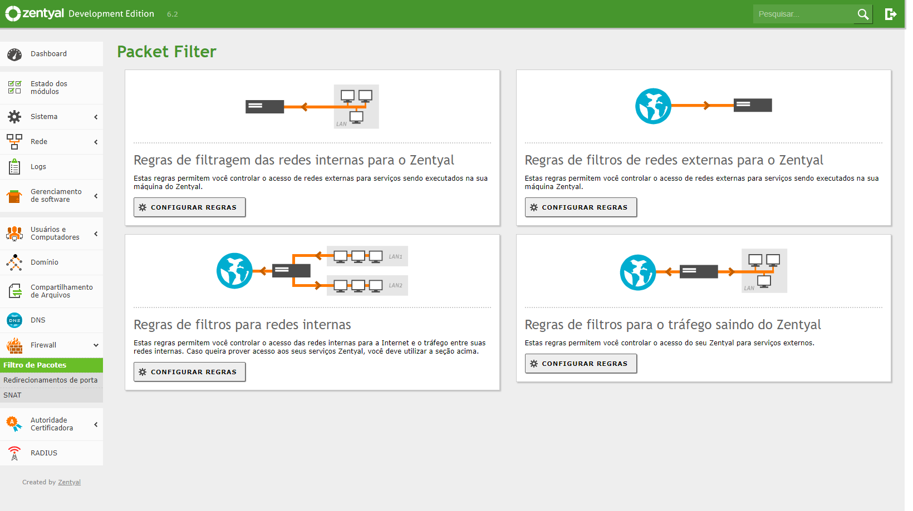
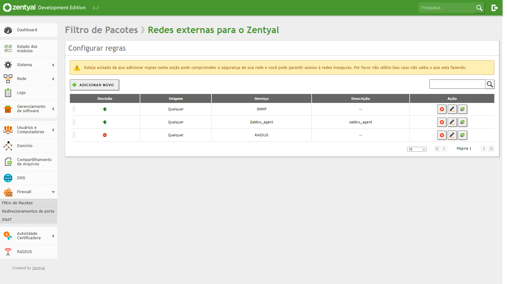
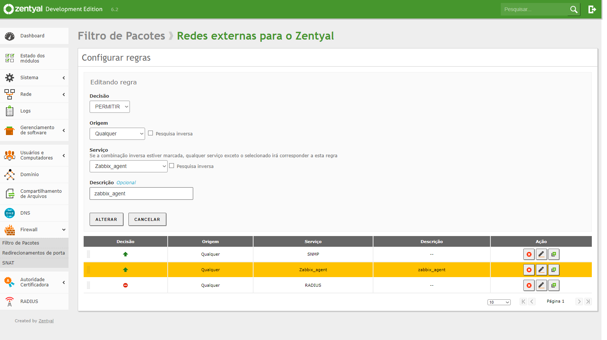
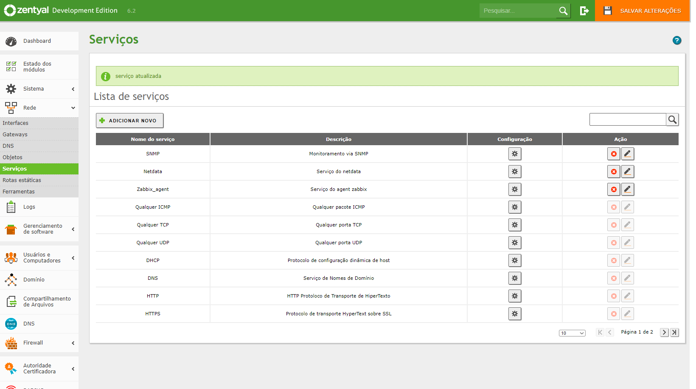
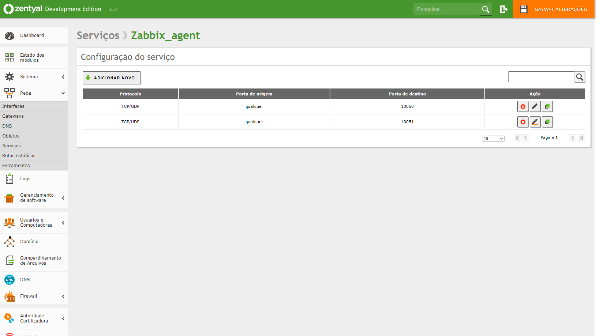
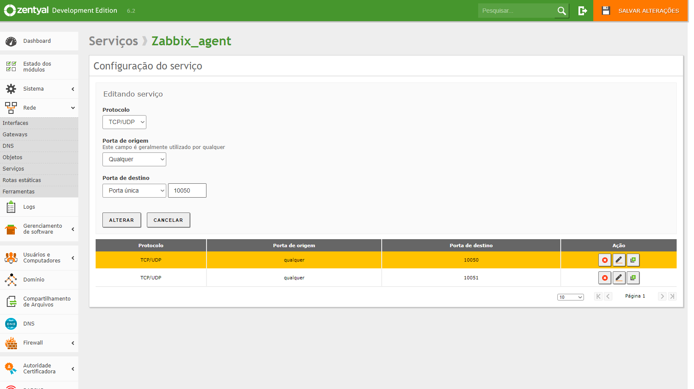

# Sobre o Zentyal

O Zentyal Server é um aplicativo open source de web decorrente da evolução da plataforma eBox, que começou a ser utilizada em 2004. Atualmente seu código base pertence à eBox Technologies, e o código fonte está disponível de acordo com os termos da licença pública geral GNU. Com foco na usabilidade, seu grande objetivo é a administração de redes de pequenas e médias empresas que buscam uma solução alternativa aos tradicionais produtos com estrutura da Microsoft. Utilizando uma interface amigável, busca reunir em um único local diversos serviços de uma empresa, como acesso à internet, segurança de rede, compartilhamento de arquivos, infraestrutura de redes e comunicação. amentas e serviços do Zentyal server As funcionalidades do Zentyal podem ser agrupadas. 

## Implantação na SEMED

Para proporcionar um ambiente de rede seguindo os *Pilares da Segurança da Informação*, tornou-se necessário a implantação do Servidores de Controlador de Domínio.

Foram criados dois servidores com essa função o ***adserver***, virtualizado no VMware, e o ***ad2server*** sendo uma maquina física, criando um ambiente com redundancia para a listas de usuários e regras.

### Importação dos usuários
Para agilizar a tarefa de cadastrar todos os funcionarios foi criado uma planilha, como está abaixo, salvo em txt:

nome|senha
-----|----
:usuário.01|123
:usuário.02|123
:usuário.03|123
:usuário.04|123

Foi realizado esta rotina
~~~~shell
# sudo apt-get install gawk
# nano importacao 
      gawk -F ":" '{ print $2,$3 }' usuario.txt | while read LISTA; do $(echo "/usr/bin/samba-tool user add $LISTA --must-change-at-next-login --use-username-as-cn"); done;
# sudo chmod +x importacao
~~~~

### Encontrando a Senha do MySql

Durante a instalação do Zentyal é criado de forma aleatoria a senha do Mysql

~~~~shell
$ echo $(sudo cat /var/lib/zentyal/conf/zentyal-mysql.passwd)
XFrY7jw0
~~~~

## Comandos do domínio 

* Checagem do banco de dados do Samba em busca de erros no Domínio: 
``$ sudo samba-tool dbcheck;``

* Resetar as permissões do sysvol: 
``$ sudo samba-tool ntacl sysvolreset``;

* Lista das GPOs do domínio: 
``$ sudo samba-tool gpo listall``;

* Lista grupos: 
``$ sudo samba-tool group list``;

* Lista usuários: 
``$ sudo samba-tool user list``;

* Verifica o status da replicação do domínio os servidores secundários: 
``$ sudo samba-tool drs showrepl``;

* Nível da funcional e da floresta: 
``$ sudo samba-tool domain level show``;

Informações do domínio: 

``$ sudo samba-tool domain info 172.15.0.3``;

      GENSEC backend 'gssapi_spnego' registered
      GENSEC backend 'gssapi_krb5' registered
      GENSEC backend 'gssapi_krb5_sasl' registered
      GENSEC backend 'spnego' registered
      GENSEC backend 'schannel' registered
      GENSEC backend 'naclrpc_as_system' registered
      GENSEC backend 'sasl-EXTERNAL' registered
      GENSEC backend 'ntlmssp' registered
      GENSEC backend 'ntlmssp_resume_ccache' registered
      GENSEC backend 'http_basic' registered
      GENSEC backend 'http_ntlm' registered
      GENSEC backend 'krb5' registered
      GENSEC backend 'fake_gssapi_krb5' registered
      Forest           : semed-ni.intra
      Domain           : semed-ni.intra
      Netbios domain   : SEMED-NI
      DC name          : adserver.semed-ni.intra
      DC netbios name  : ADSERVER
      Server site      : Default-First-Site-Name
      Client site      : Default-First-Site-Name

Verifica os controladores via TCP e UDP: 

``$ host -t SRV _ldap._tcp.semed-ni.intra``;

      ldap._tcp.semed-ni.intra has SRV record 0 100 389 ad2server.semed-ni.intra.

      _ldap._tcp.semed-ni.intra has SRV record 0 100 389 adserver.semed-ni.intra.

``$ host -t SRV _kerberos._udp.semed-ni.intra``.

      _kerberos._udp.semed-ni.intra has SRV record 100 100 88 ad2server.semed-ni.intra.
      _kerberos._udp.semed-ni.intra has SRV record 100 100 88 adserver.semed-ni.intra.
      _kerberos._udp.semed-ni.intra has SRV record 0 100 88 adserver.semed-ni.intra.
      _kerberos._udp.semed-ni.intra has SRV record 0 100 88 ad2server.semed-ni.intra.

Obs:
1. O parâmetro **–must-change-at-next-login** serve para o usuário altera a senha no próximo logon;
2. O local do samba-tool pode variar. 

## Principais usos

1. Controle de acesso ao servidor de acesso;
2. Regras de Acesso no servidor;
3. Usuários para sistemas usados internamente;
4. Contreole de acesso de usuários a Wi-Fi;
4. Acesso aos computadores.

### Administração Remota do Domínio – RSAT
O RSAT é um conjunto de ferramentas que inclui o Gerenciador do Servidor, snap-ins do MMC (Microsoft Management Console), os consoles, os provedores e os cmdlets do Windows PowerShell, além de ferramentas da linha de comando para o gerenciamento de funções e recursos executados no Windows Server.

### Objetos de Politicas de Grupos – GPO
Diretiva de Grupo, ou Group Policy (GPO), é uma funcionalidade da família de sistemas operacionais Microsoft Windows NT. É um conjunto de regras que controlam o ambiente de trabalho de contas de usuário e contas de computador. Ela fornece o gerenciamento e configuração centralizados de sistemas operacionais, aplicativos e configurações dos usuários em um ambiente Active Directory. Em outras palavras, a Diretiva de Grupo controla em parte o que os usuários podem ou não fazer em um sistema de computador. 

-----

## Instalando o Zabbix-agent

Para monitorar os equipamentos foi implementado o Zabbix, nos Controladores de Domínio foram feitos alguns processos adcionais devido aos seus miveis de segurança.

~~~~shell
$ sudo apt update
$ sudo apt install zabbix-agent
$ sudo nano /etc/zabbix/zabbix_agentd.conf
      EnableRemoteCommands=0
      Server=172.15.0.2
      ServerActive=172.15.0.2
$ sudo service zabbix-agent restart
$ sudo service zabbix-agent status
~~~~

Pronto agent em funcionamento, falta liberar a porta de acesso na WebAdmin

Tela de configurações do firewall

Tela das regras do firewall

Configuração da regra e necessário a criação do serviço

Lista de serviços liberados

Configurações das portas

Liberação das portas

Pronto, se tudo tiver dado certo logo o Zabbix ira receber as informações do Zentyal.

----
# Migração do Zentyal
Com o tempo pode ser necessário a troca da maquina do servidor, ou migra-lo para uma instancia virtual.

O **ad2server** estáva em uma *maquina física*, mas estou realizando a migração dos servidores para a virtualização, quando possível, mas por boas praticas de rede é recomendado a existência de dois servidores de autenticação, o **adserver** já estava virtualizado no mesmo Hypervisor do pfSense, o VMware que está voltado para a "infraestrutura básica", então o **ad2server** foi migrado no ProxMox assim continuam em hardware distintos. O processo de migração seguiu os seguintes passos:

1. [Criação da VM](ad2-migracao\1-VM\vm.md);
2. Instalação do Zentyal;
3. Primeira Inicialização;
4. Migração das configurações.

----
## Notas 
* Falha na criação de usuário (no criação do informava que já existia)
sudo samba-tool dbcheck
sudo samba-tool dbcheck --fix --yes

## Erro no DNS

https://forum.zentyal.org/index.php?topic=33117.0

https://forum.zentyal.org/index.php?topic=30747.15

## Servidor de Impressão 
sudo apt-get install cups
cupsctl --remote-admin --remote-any --share-printers