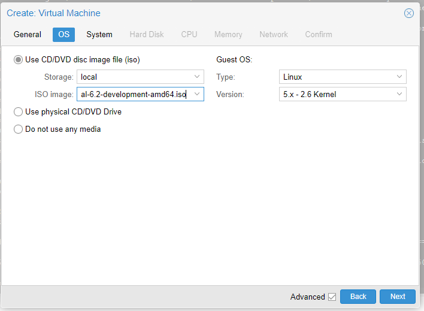
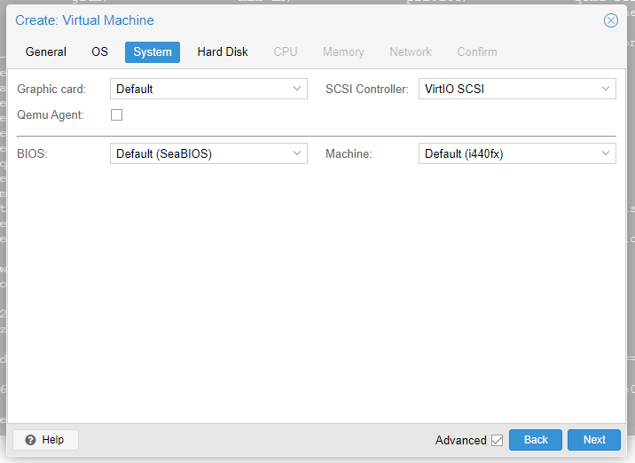
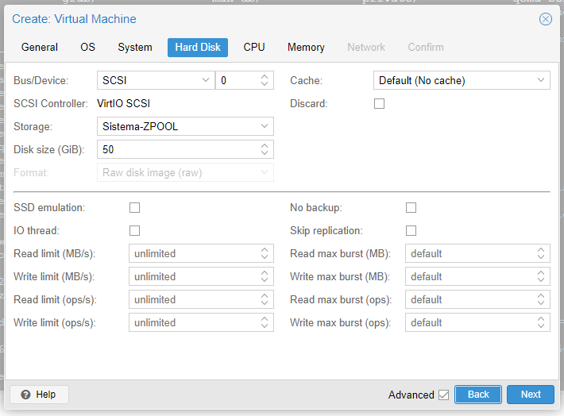
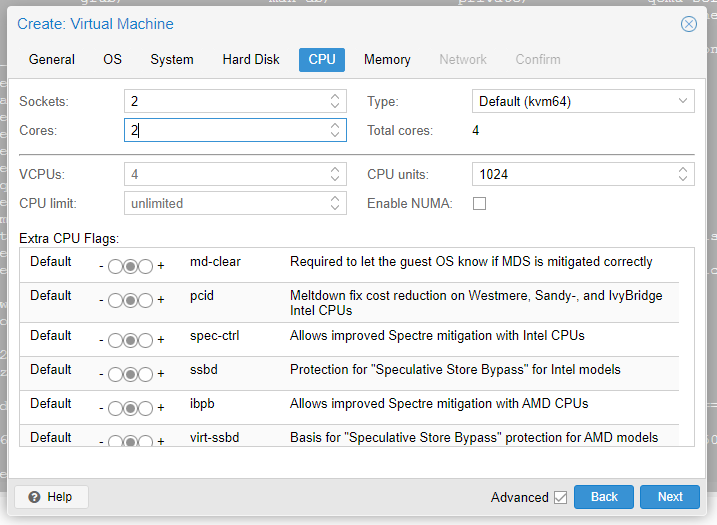
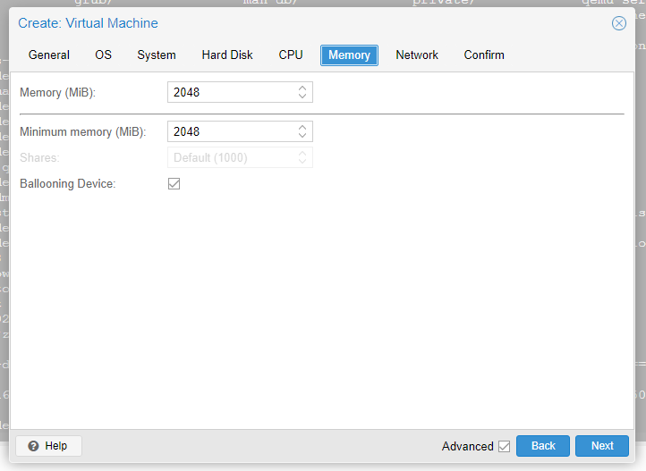

# Criação da Instância da VM

* Configuração básica, Node onde a VM estará, se a VM ira iniciar no automaticamente, nome, ID...

* Seleção do Sistema Operacional (Linux) e escolha da localização da *iso*.

* Arquitetura do "hardware"

* Preparação do Armazenamento, locação do HD virtual, tamanho...

* Recursos de CPU para utilização da VM;

* Alocação de memoria;

* Configuração da interface de rede; 

* Resumo das configurações e **iniciar ao fechar**;

* VM iniciada.