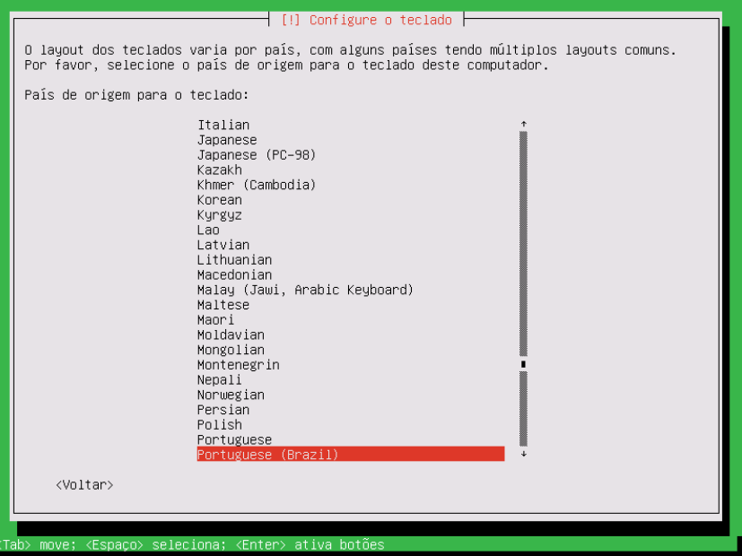
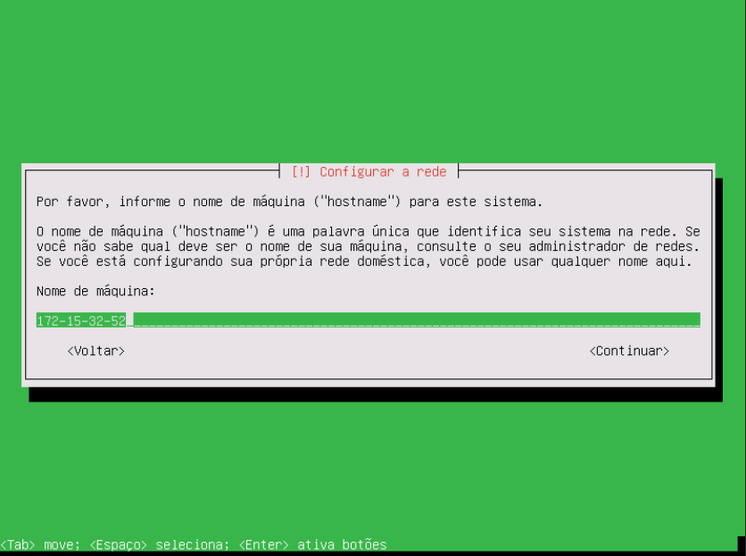
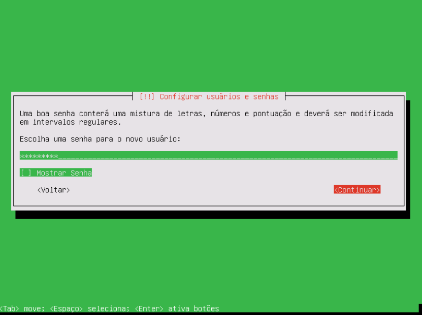
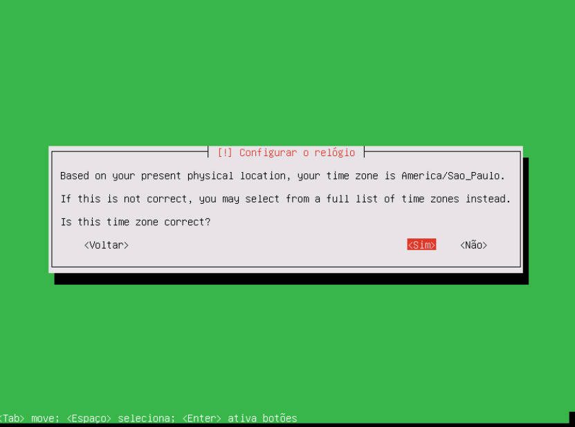
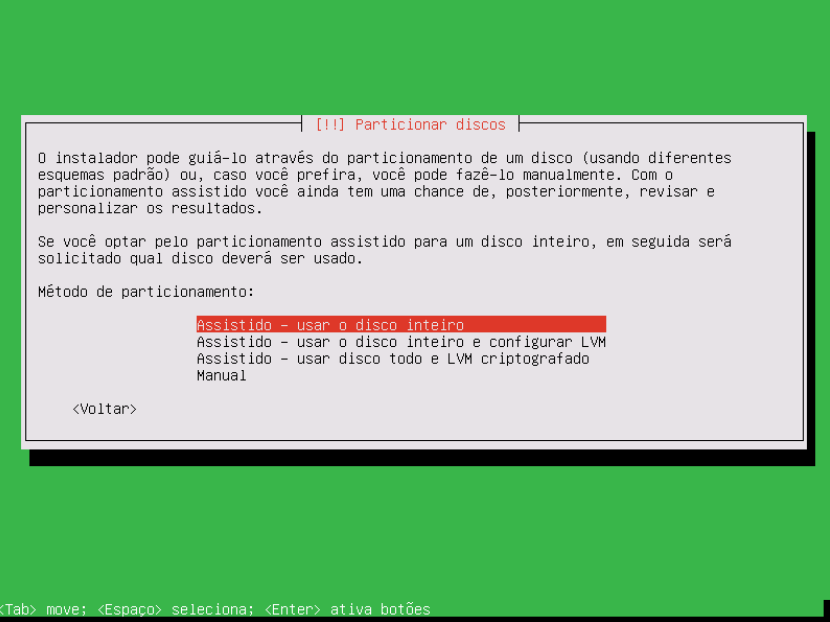
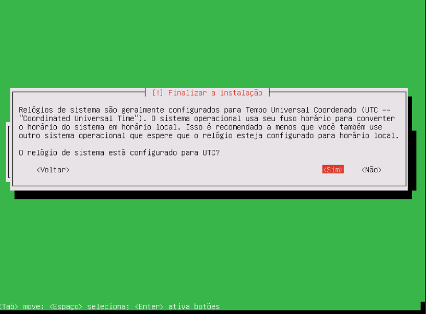

# Instalação da Zentyal

A instalação do Zentyal é a mesma do Ubuntu na versão simples. Foi escolhida a instalação *expert mode* para a melhor montagem do sistema.
 

* Menu escolha de inicialização, sendo possível:
    
    * Instalação mais simples (delete all disk);
    * Instalação em mode expert;
    * Verificação na media de instalação;
    * Teste de memória RAM; 
    * Iniciar pelo HD;
    * Modo de recuperação para recuperação do sistema.

* As 3 primeiras telas são para configurações do idioma;

* Escolha do nome da instalação, por padrão aparece o IP da maquina, na dashboard será trocado;

* Criação da conta do administrador do Sistema Operacional, não do Domínio;

* Configuração da senha do administrador do Sistema Operacional e confirmação da senha;

* Ajuste do relógio, ponto importante para a integridade do domínio.

## Particionamento do HD

