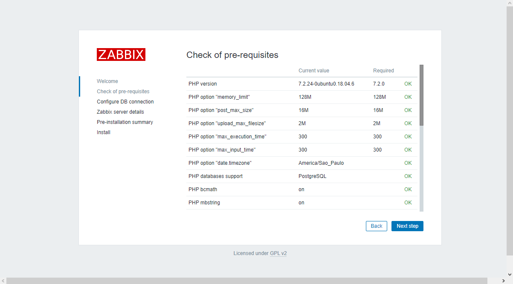
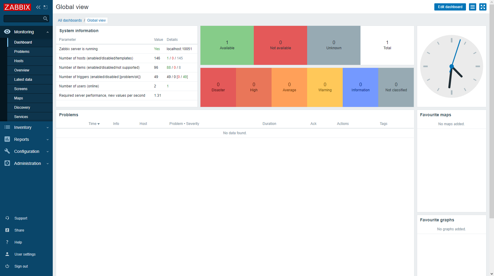

# Função 
Esse PC terá a função de fornecer uma central de serviços de ti:
* Inventario (GLPI);
* Monitoramento (Zabbix);
* Alertas;
* Etc.

## Recursos de Hardware

Hardware | Recursos
---------|-----------
CPU | Intel Core2 Duo E8400
Men| 5GB
HD| 250GB
Rede| 2 

### Ajustes iniciais 
 Localização
 Verifica localização e ajustando para São Paulo

`timedatectl status`

`timedatectl list-timezones | grep Sao`

`timedatectl set-timezone America/Sao_Paulo`

## Sistema Operacional 

## Inventario (GLPI)

***
## Monitoramento (Zabbix)

1. Instalando os repositorio

~~~~Shell
# wget https://repo.zabbix.com/zabbix/5.0/ubuntu/pool/main/z/zabbix-release/zabbix-release_5.0-1+bionic_all.deb
# sudo dpkg -i zabbix-release_5.0-1+bionic_all.deb
# sudo apt update
~~~~

2. Instalando Zabbix server, frontend e agent

~~~~shell
# sudo apt install zabbix-server-pgsql zabbix-frontend-php php7.2-pgsql zabbix-apache-conf zabbix-agent`
~~~~

3. Criando base de dados inicial

You need to have database username user set up with permissions to create database objects.
Create Zabbix database on PostgreSQL with the following commands:

~~~~console
 # sudo -u postgres createuser --pwprompt zabbix
 # sudo -u postgres createdb -O zabbix zabbix
~~~~

Infortação dos schema e data inicial:

~~~~shell
# zcat /usr/share/doc/zabbix-server-pgsql*/create.sql.gz | sudo -u zabbix psql zabbix
~~~~
4. Configuração do DB para Zabbix server

Edit server host, name, user and password in zabbix_server.conf as follows, replacing <username_password> with actual password of PostgreSQL user:

~~~~shell
# sudo nano /etc/zabbix/zabbix_server.conf
~~~~
~~~~
DBName=zabbix
DBUser=zabbix
DBPassword=<username_password>
DBPort=5432
~~~~
5. Configurar o PHP do Zabbix frontend

Edit file /etc/zabbix/apache.conf, uncomment and set the right timezone for you.

~~~~shell
# sudo nano  /etc/zabbix/apache.conf
~~~~
~~~~
php_value date.timezone America/Sao_Paulo
~~~~

6. Iniciar o Zabbix server e agent no boot da hardware

Start Zabbix server and agent processes and make it start at system boot.
~~~~shell
# sudo systemctl restart zabbix-server zabbix-agent apache2
# sudo systemctl enable zabbix-server zabbix-agent apache2
# sudo service apache2 restart
~~~~
### Finalização da instalação no frontend

Confirmação das dependências

Configurações do acesso ao banco de dados

Detalhes do servidor, host, porta, hostname

Sumário da Pre-instalação

Finalização da instalação

Tela login

Dashboard inicial

Tela de configuração do perfil administrador 

### Ativação da tradução
A tradução é ativada através da localização do sistema

~~~~shell
sudo locale-gen pt_BR && sudo locale-gen pt_BR.UTF-8
~~~~

## zabbix_get
O Zabbix Get é um utilitário de linha de comando que pode ser utilizado para se comunicar com o agente de monitoração do Zabbix e requisitar um dado do agente.
lado servidor
zabbix_get -s 172.15.0.3 -p 10050 -k system.hostname

log
sudo tail -f /var/log/zabbix/zabbix_server.log
sudo cat /var/log/zabbix/zabbix_server.log | grep "adserver"

lado agente
netstat -a | grep "zabbix"

sudo nano /etc/zabbix/zabbix_agentd.conf && sudo service zabbix-agent restart &&  sudo  tail -f /var/log/zabbix-agent/zabbix_agentd.log
