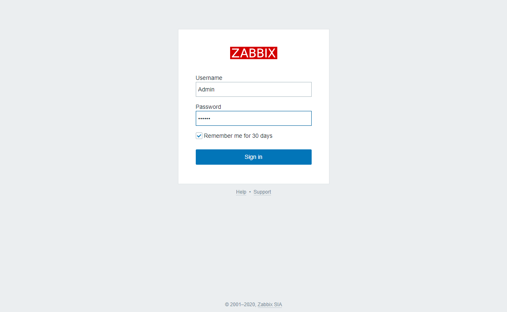

# Documentação do Servidor de Ativos de TI

O intuito deste servidor é centralizar as informações do Setor de TI em um único local, apesar de para isso ser usado vários sistemas.

## Servidor Athena 
O servidor se chamara Athena devido a deusa Grega da sabedoria, guerra e justiça, o servidor terá: 
* GLPI para saber quais equipamentos possuímos;
* Zabbix para saber o que estamos enfrentando;
* LogAnalizer para auditar os logs dos equipamentos usados na Sede

## Preparação do Hardware
A principio não é possível a utilização propriamente de um servidor quanto a hardware então optei por usar um gabinete antigo, com o seguites hardware 

Item | Hardware
-----|-------
placa-mãe |Dell Optplex 990 
CPU |Intel(R) Core(TM) i3-2120 CPU @ 3.30GHz
Memoria | 4 pentes de 2GB DDR3 com frequencia de 1333 MHz, totalizando 8GB
Placa de Rede| 82579LM Gigabit Network Connection onboard com capacity: 1Gbit/s, **deveria ser duas placas de rede para criação de um Bonding, mas a placa não foi reconhecida pelo CentOS**
Armazenamento | Raid 0 com 500GB, via hardware (estas placas mãe da Dell tem esse suporte)
HD's | 2 WDC WD2500AAKX-7 da Western Digital, os mesmos que vem com computadores

## Instalação 

Para a instalação foi usada a iso CentOS-7-x86_64-NetInstall-2003 do site do próprio CentOS.
Foram realizados particionamentos para garantir o funcionamentos do Sistema, visto que ele será usado para armazenar os Log's da rede.

Estrutura de particionamento do RAID, para instalação.

Ponto de montagem | Espaço
----|----
/home | 188,26 GiB
BIOS boot | 2048 KiB
/boot | 2048 MiB
/ | 65,19 GiB
/var | 205,92 GiB
swap | 4212 MiB

Particionamento do servidor em inicio de atividades.

Mounted As|	Type|	Free|	Total|	Device ID
--|--|--|--|--
/|	xfs|	96% (62.49 GiB)	|65.16 GiB|	/dev/mapper/centos-root
/boot|	xfs|	91% (1.79 GiB)	|1.98 GiB	| UUID=8e1717aa-4eab-4077-99d1-e2b7a0a0cb41
/home|	xfs|	100% (188.06 GiB)|	188.16 GiB|	/dev/mapper/centos-home
/var|	xfs|	94% (192.63 GiB)|	205.81 GiB|	/dev/mapper/centos-var

## Pois instalação

Atualizar o sistema 

~~~~shell
# yum update

# yum upgrade
~~~~

## Informações do hardware

Informações da placa mãe: ``# lshw``

Informações do Processador: ``# lscpu``

## Alteração de arquivos

Remoção dos recursos de IPv6, visto que a rede interna funciona toda com IPv4.

cat /etc/sysconfig/network-scripts/ifcfg-enp0s25
~~~~
IPV6INIT="no"
IPV6_AUTOCONF="no"
IPV6_DEFROUTE="no"
~~~~

adicionar nas linhas finais /etc/sysctl.conf, altera o uso do swap usando seria como usar quando atingir 90%

~~~~shell
# nano /etc/sysctl.d/99-sysctl.conf
    vm.swappiness = 10
    vm.vfs_cache_pressure = 50
~~~~

Explicações (site Natan Felles)

**swappiness**: Controla como o kernel realiza as trocas de cache na RAM. Ao aumentar esse valor, aumentará a quantidade de trocas. O valor padrão é 60, colocando 10 significa que a Swap só será usada quando a RAM atingir 90%.

**vfs_cache_pressure**: Controla a tendência do kernel para recuperar a memória que é usada no cache do sistema virtual de arquivos. O valor 50 é o ideal, valores mais altos podem deixar o sistema lento e muito baixos reduzem o uso do cache.

### Redução do uso das agulhas do HD

Diminuir as gravações em disco, geradas pela gravação de acesso, por padrão todo acesso ao arquivo e gravado, assim gera mais esforço de gravação do sistema e dos HD's, para retirarmos esta função usamos o parametro **noatime** no arquivo fstab.

~~~~Shell
# mount | grep mapp
    /dev/mapper/centos-root on / type xfs| (rw,relatime,seclabel,attr2,inode64,logbsize=128k,sunit=256,swidth=512,noquota)
    /dev/mapper/centos-home on /home type xfs| (rw,relatime,seclabel,attr2,inode64,logbsize=128k,sunit=256,swidth=512,noquota)
    /dev/mapper/centos-var on /var type xfs| (rw,relatime,seclabel,attr2,inode64,logbsize=128k,sunit=256,swidth=512,noquota)
~~~~

~~~~shell
# nano /etc/fstab
    /dev/mapper/centos-home /home   xfs|     defaults,noatime        0 0
    /dev/mapper/centos-var  /varxfs     defaults,noatime        0 0
    /dev/mapper/centos-swap swapswap    defaults        0 0
~~~~

### Ajustes na segurança

Evitar ataques de Spoof ``net.ipv4.tcp_syncookies=1``
~~~~shell
# nano /etc/sysctl.d/99-sysctl.conf
    net.ipv4.conf.default.rp_filter=1
    net.ipv4.conf.all.rp_filter=1
    net.ipv4.tcp_syncookies=1
~~~~

## Otimização da inicialização 

Para otimizar a inicialização do sistema foi usado o systemd-analyze e o webmin, removendo os serviços que não serão usados para as operações do servidor.

Para verificar os serviços que estão iniciando com o sistema e seus tempos de carregamento.

```$ sudo systemd-analyze blame ```

Desabilitar os serviços que não tem a necessidade de serem iniciados com o sistema

```$ systemctl disable nome_do_serviço ```

Pode ser também necessário ativar no boot um serviço

```$ systemctl enable nome_do_serviço ```

verifica se esta ativo no boot

```$ sistemctl is-enable nome_do_serviço ```

Inicialização do servidor já finalizado, alem das otimizações, já esta com o GLPI, Zabbix e LogAnalyzer em funcionamento

~~~~shell
# systemd-analyze 
    Startup finished in 451ms (kernel) + 2.673s (initrd) + 21.837s (userspace) = 24.962s
~~~~

## Processos ativos no boot

Tempo | Processo| Função 
----|---|--
6.625s|  mariadb.service| SGBD do GLPI e LogAnalyzer
5.228s| postgresql.service | SGBD do Zabbix
4.801s |rh-php72-php-fpm.service | Serviço do PHP
4.793s| httpd.service | Servidor Web Apache
4.442s| kdump.service
4.431s| NetworkManager-wait-online.service
2.231s| dev-mapper-centos\x2droot.device
2.211s |initrd-switch-root.service
1.850s |lvm2-monitor.service
1.803s |lvm2-pvscan@259:2.service
1.451s |dracut-initqueue.service
1.084s |webmin.service | Serviço de Webmin
870ms |var.mount | Montagem do /var
795ms |boot.mount| Montagem do /boot
690ms |home.mount | Montagem do /home
635ms |systemd-tmpfiles-setup-dev.service
564ms |tuned.service
445ms |systemd-udevd.service
423ms |plymouth-read-write.service
412ms |rhel-domainname.service
405ms |systemd-journal-flush.service
391ms |rhel-readonly.service
359ms| firewalld.service |Serviço do Firewall
340ms |systemd-tmpfiles-setup.service
336ms |network.service
335ms |rhel-dmesg.service
326ms| microcode.service
321ms|systemd-journald.service
303ms |chronyd.service
300ms |systemd-backlight@backlight:acpi_video0.service
296ms |auditd.service
289ms |NetworkManager.service
278ms |polkit.service
277ms |systemd-user-sessions.service
275ms |mdmonitor.service
274ms |systemd-random-seed.service
273ms |rhel-import-state.service
224ms |sysroot.mount
212ms |systemd-sysctl.service
151ms |kmod-static-nodes.service
146ms |dracut-pre-pivot.service
144ms |dev-mqueue.mount
137ms |zabbix-agent.service |Serviço do agente do Zabbix
133ms| dracut-cmdline.service
129ms |plymouth-quit.service
129ms |plymouth-quit-wait.service
128ms |ipmi.service
127ms |dev-hugepages.mount
124ms |systemd-udev-trigger.service
122ms |sys-kernel-debug.mount
108ms |systemd-readahead-collect.service
103ms |systemd-readahead-replay.service
97ms |systemd-remount-fs.service
85ms |lm_sensors.service | Sensores para monitorar a temperatura 
75ms |dracut-pre-trigger.service
71ms |initrd-parse-etc.service
71ms |systemd-vconsole-setup.service
65ms |zabbix-server.service | Serviço do Servidor do Zabbix
61ms |dev-mapper-centos\x2dswap.swap
53ms |sshd.service | Serviço do ssh
46ms |dracut-pre-udev.service
34ms |systemd-logind.service
33ms |systemd-tmpfiles-clean.service
32ms |systemd-update-utmp.service
22ms| plymouth-start.service
21ms |plymouth-switch-root.service
18ms |dracut-pre-mount.service
18ms |initrd-cleanup.service
18ms |systemd-fsck-root.service
14ms |systemd-readahead-done.service
10ms| rsyslog.service | Serviço do sistema de log (rsyslog)
7ms |systemd-update-utmp-runlevel.service
5ms |initrd-udevadm-cleanup-db.service
3ms |sys-kernel-config.mount

### SSH
- [x] Não permitir que o usuário root sejá acessado via ssh;
- [ ] Alterar a porta de acesso;
- [ ] Liberar o acesso sem senha para estação de apoio;

#### Bloquear acesso ao remoto ao root

~~~~shell
# nano /etc/ssh/sshd_config

    PermitRootLogin no

# service sshd.service restart
~~~~

## Sem proteção de tela (extra)
O terminal do servidor depois de uns minitos fica com a tela desligada como estava em processo de montagem desativei está função, para o usuário root.
~~~~shell
nano ~/.bashrc
    setterm -blank 0
~~~~

## SeLinux

~~~~shell
#  yum install setools setroubleshoot
~~~~

## SNMP

Este servidor será utulizado com recursos do snmp, então pode ser utilizado o snmpwalk

Com a tradução das mibs
~~~~shell
# snmpwalk -v 2c -c public nas

    SNMPv2-MIB::sysDescr.0 = STRING: FreeNAS-11.2-U4.1 (e33ce960b8). Hardware: amd64 Intel(R) Xeon(R) CPU           E5506  @ 2.13GHz running at 2132. Software: FreeBSD 11.2-STABLE (revision 199506)
    SNMPv2-MIB::sysObjectID.0 = OID: NET-SNMP-MIB::netSnmpAgentOIDs.8
    DISMAN-EVENT-MIB::sysUpTimeInstance = Timeticks: (553659986) 64 days, 1:56:39.86
    SNMPv2-MIB::sysContact.0 = STRING: semed.ni.ti@gmail.com
    SNMPv2-MIB::sysName.0 = STRING: nas.semed-ni.intra
    SNMPv2-MIB::sysLocation.0 = STRING: Setor de TI
    ....
~~~~

Sem a tradução das mibs
~~~~shell
# snmpwalk -v 2c -On -c public nas

    .1.3.6.1.2.1.1.1.0 = STRING: FreeNAS-11.2-U4.1 (e33ce960b8). Hardware: amd64 Intel(R) Xeon(R) CPU           E5506  @ 2.13GHz running at 2132. Software: FreeBSD 11.2-STABLE (revision 199506)
    .1.3.6.1.2.1.1.2.0 = OID: .1.3.6.1.4.1.8072.3.2.8
    .1.3.6.1.2.1.1.3.0 = Timeticks: (553675819) 64 days, 1:59:18.19
    .1.3.6.1.2.1.1.4.0 = STRING: semed.ni.ti@gmail.com
    .1.3.6.1.2.1.1.5.0 = STRING: nas.semed-ni.intra
    .1.3.6.1.2.1.1.6.0 = STRING: Setor de TI
    ....
~~~~

# Administração remota - Webmin

O Webmin é de longe a mais antiga e completa ferramenta livre, web-based, para gerenciamento de servidores Linux em atividade. Desenvolvido quase que integralmente em Perl, baseada no paradigma da programação em camadas, com suporte multi-idiomas e distribuído sob a licença BSD-like, atualmente (neste exato momento em que escrevo) o Webmin está na sua versão 1.479 e possui versões tanto para Linux, quanto Solaris, HP/UX, Apple MacOS X e alguns outros ports como para FreeBSD e até mesmo Windows. Todas as versões podem ser obtidas através da página oficial de downloads do projeto. Aproveitando-se do conceito de desenvolvimento em camadas (modular) e do fato de ser um software livre, é possível também se obter os módulos individualmente, bem como, desenvolver módulos adicionais sob demanda.

O Webmin roda sob o protocolo SSL (HTTPS) e portanto, caso você ainda não possua os pacotes mínimos necessários, vai precisar instalá-los:

Instalação via repositorio e liberação da porta

~~~~shell
# nano  /etc/yum.repos.d/webmin.repo

        [Webmin]
        name=Webmin Distribution Neutral
        #baseurl=https://download.webmin.com/download/yum
        mirrorlist=https://download.webmin.com/download/yum/mirrorlist
        enabled=1

# wget https://download.webmin.com/jcameron-key.asc
# rpm --import jcameron-key.asc

# yum install webmin

# firewall-cmd --zone=public --add-port=10000/tcp --permanent
~~~~

## Configuração de rede
A principio foi usado para configurar a rede o utilitário **nmtui**, com a instalação do **webmin** a configuração foi refeita e criada uma interface virtual.

Interface | IP
----|---
 Física |172.15.0.1
Virtual|172.15.0.2
Virtual para o switch |192.168.0.11


# instalação do GLPI com o materiasl do Workshop Full Stack - Servicedesk Brasil

yum install openssh openssh-server
firewall-cmd --permanent --zone=public --add-service=ssh
firewall-cmd --reload

yum install -y epel-release
yum -y install https://repo.percona.com/yum/percona-release-latest.noarch.rpm
yum -y install http://rpms.remirepo.net/enterprise/remi-release-7.rpm

yum -y install net-tools wget yum-utils ntp bzip2 unzip

yum-config-manager --enable remi
yum-config-manager --enable remi-glpi94
yum-config-manager --enable remi-php72
yum-config-manager --enable remi-debuginfo

yum -y install Percona-Server-server-57

yum -y install glpi php-pecl-zendopcache php-pecl-apcu php-soap php-xmlrpc php-pear-CAS php-snmp php-sodium 

yum install -y glpi-fusioninventory fusioninventory-agent*

yum -y update

mv /usr/share/glpi/ /usr/share/glpi-v946

wget https://github.com/glpi-project/glpi/releases/download/9.5.1/glpi-9.5.1.tgz

tar -xzf glpi-9.5.1.tgz -C /tmp

mv /tmp/glpi /usr/share/glpi/ 

cp -rp /usr/share/glpi-v946/inc/downstream.php /usr/share/glpi/inc/.
cd /usr/share/
chown -R apache:apache glpi

systemctl restart ntpd
systemctl enable ntpd

systemctl restart httpd 
systemctl enable httpd

systemctl restart mysqld
systemctl enable mysqld

	• Para atualziação do MySQL/Percona Server

mysql_upgrade -uroot -p 
(/bsz#<P4UjY
- Firewall

firewall-cmd --permanent --zone=public --add-service=http
firewall-cmd --permanent --zone=public --add-service=https
firewall-cmd --reload

- SELinux

setsebool -P httpd_can_sendmail 1
setsebool -P httpd_can_network_connect 1
setsebool -P httpd_can_network_connect_db 1
setsebool -P httpd_mod_auth_ntlm_winbind  1
setsebool -P allow_httpd_mod_auth_ntlm_winbind 1

setenforce 0 (para instalação e update do GLPI via Remi Collet)

- MySQL

cat /var/log/mysqld.log |grep generated 
2020-06-19T04:10:57.404342Z 1 [Note] A temporary password is generated for root@localhost: #lj&0F877idZ
=>  O8?yPq!Fzpz7
SENHA DO TEMPORARIA do MySQL

Alterar a Senha do root

mysql_secure_installation

Yes
Yes
Yes
Yes
Yes

mysql -uroot -p 
@SemedNI#20

root
SENHA_NOVA_R00T

CREATE USER 'glpi_user_db'@'%' IDENTIFIED BY 'GLP1@db2020'; (pode ser necesssario colocar como usuário do localhost)
GRANT USAGE ON *.* TO 'glpi_user_db'@'%' IDENTIFIED BY 'GLP1@db2020'; 
CREATE DATABASE IF NOT EXISTS `glpi_db` CHARACTER SET utf8mb4 COLLATE utf8mb4_general_ci;
GRANT ALL PRIVILEGES ON `glpi_db`.* TO 'glpi_user_db'@'%';
GRANT SELECT ON `mysql`.`time_zone_name` TO 'glpi_user_db'@'%' IDENTIFIED BY 'GLP1@db2020';
SELECT NOW();
SET @@global.time_zone = '+3:00';
SELECT NOW();
SET time_zone='America/Sao_Paulo';
SELECT @@time_zone;
FLUSH PRIVILEGES;
exit

mysql -uglpi -p

glpi
GLP1@db2020

show databases;
exit

- TimeZone do Linux, PHP/Apache e MySQL x GLPi

Local

rm -f /etc/localtime
ln -s /usr/share/zoneinfo/America/Sao_Paulo /etc/localtime
hwclock -w

PHP/Apache

vi /etc/php.ini

(Pesquisa date.timezone)

/date.timezone 

;date.timezone =

date.timezone = America/Sao_Paulo

Tamanho do Upload de Arquivos

(Pesquisa upload_max_filesize)

/upload_max_filesize

upload_max_filesize = 2M

upload_max_filesize = 20M

:wq

MySQL

mysql_tzinfo_to_sql /usr/share/lib/zoneinfo | mysql -uroot -p --force mysql
mysql_tzinfo_to_sql /usr/share/zoneinfo | mysql -u root -p -Dmysql

	• Instalação via Console

(Validação dos Requisitos)

glpi-console glpi:system:check_requirements

--default-language=DEFAULT_LANGUAGE

glpi-console glpi:database:install -p

Database name:glpi
Database user:glpi
Database password: GLP1@db2020

Do you want to continue ? [Yes/no] 

Yes

Installation done.


Configuração da CRON

Configurar > Ações Automáticas

Alterar exebição para 40 itens
Alterar de GLPI para CLI (Selecionar tudo, Ações > Atualizar > Modo de Execução)

vi /etc/cron.d/glpi

/usr/bin/php /usr/share/glpi/front/cron.php

Incluir na CRON

    * * * * * apache /usr/bin/php /usr/share/glpi/front/cron.php --force  mailgate
    * * * * * apache /usr/bin/php /usr/share/glpi/front/cron.php --force  queuednotification
    00 22 *** apache glpi-console glpi:ldap:synchronize_users
    */15 **** apache glpi-console glpi:task:unlock -a

systemctl restart crond

Configuração do FusionInventory

Configurar > Plugin (Instalar > Habilitar)

Administração > Entidades > Guia FusionInventory

Modelo para a transferência (Complete)

URL da Aplicação (http://glpiv95.glpibrasil.com.br)


------------
# Zabbix
Zabbix é uma ferramenta de software de monitoramento de código aberto para diversos componentes de TI, incluindo redes, servidores, máquinas virtuais e serviços em nuvem. O Zabbix fornece métricas de monitoramento, entre outras, utilização da rede, carga da CPU e consumo de espaço em disco. Wikipedia 

Instalação foi feita seguindo os passos do site do Zabbix:

~~~~shell
# rpm -Uvh https://repo.zabbix.com/zabbix/5.0/rhel/7/x86_64/zabbix-release-5.0-1.el7.noarch.rpm
# yum clean all
# yum install zabbix-server-pgsql zabbix-agent
# yum install centos-release-scl
~~~~

habilitar o repositorio do frontend

~~~~shell
# nano /etc/yum.repos.d/zabbix.repo

    [zabbix-frontend]

    enabled=1
~~~~

Instalação dos pacotes do frontend

~~~~shell 
# yum install zabbix-web-pgsql-scl zabbix-apache-conf-scl
~~~~

Criação inicial do banco de dados

~~~~shell
# sudo -u postgres createuser --pwprompt zabbix
# sudo -u postgres createdb -O zabbix zabbix
~~~~

Importando o schema e dados do zabbix

~~~~shell
# zcat /usr/share/doc/zabbix-server-pgsql*/create.sql.gz | sudo -u zabbix psql zabbix
~~~~

Configurando o acesso ao banco de dados

~~~~shell
# nano /etc/zabbix/zabbix_server.conf

    DBPassword=password
~~~~

Configurando o timezone

~~~~shell
nano  /etc/opt/rh/rh-php72/php-fpm.d/zabbix.conf
    php_value[date.timezone] = America/Sao_Paulo
~~~~

Iniciando e colocando no Boot os serviços do server, agent apache e PHP

~~~~shell
# systemctl restart zabbix-server zabbix-agent httpd rh-php72-php-fpm
# systemctl enable zabbix-server zabbix-agent httpd rh-php72-php-fpm
~~~~

### Finalização da instalação no frontend

Confirmação das dependências

Configurações do acesso ao banco de dados

Detalhes do servidor, host, porta, hostname

Sumário da Pre-instalação

Finalização da instalação

Tela login

Dashboard inicial

Tela de configuração do perfil administrador 


## Correção de alertas do Zabbix

Para resolver algumas mensagens de erro do Zabbix e preciso realizar otimizações nas configurações do arquivo zabbix_server.conf, até o momento os erros que tem aparecido são: 

* Zabbix icmp pinger processes more than 75% busy;
* Zabbix unreachable poller processes more than 75% busy;
* Zabbix housekeeper processes more than 75% busy;

Para soluciona-los foi alterado os valores
*  StartPingers;
*  StartPollers.

~~~~shell
# nano /etc/zabbix/zabbix_server.conf
   ......
   StartPingers=10
   ......
   StartPollers=20
   ......
   StartDiscoverers=5
   ......
   HousekeepingFrequency=20
   ......
   MaxHousekeeperDelete=0
   ......

# service zabbix-server status
~~~~

## Aumentado o poder do Zabbix

Para o Zabbix desempenhar sua função da melhor forma possível é utilizado algumas outra aplicações.

### zabbix_get

O Zabbix Get é um utilitário de linha de comando que pode ser utilizado para se comunicar com o agente de monitoração do Zabbix e requisitar um dado do agente.

~~~~shell
# zabbix_get -s 172.15.0.3 -p 10050 -k system.hostname
    adserver
~~~~

~~~~shell
# yum install zabbix-get
# yum install jq
~~~~

### Usando chaves vfs.fs.get
https://www.youtube.com/watch?v=UT1FM0CUgPE


    # zabbix_agentd -t vfs.fs.discovery

    # zabbix_agentd -t vfs.fs.get

    # zabbix_get -s 127.0.0.1 -k vfs.fs.get | jq

Criação do modelo
1. criar um template (Sistema de arquivos);
2. Item	(Toda informação do Sistema de Arquivos);

* Type = Zabbix agent
* Key = vfs.fs.get
* Applications = Sistema de Arquivos

### Espaço total do NAS
Não havia este item no para o compartilamento /mnt/SEMED.
1. Usuei o comando snmpwalk para verificar se o tamanho total do estava sendo listado;
2. Clonei o item *Storage discovery: /mnt/SEMED: Used space* e alterei os itens:
    * Key: *vfs.fs.used[hrStorageSize.37]*
    * SNMP OID: *.1.3.6.1.2.1.25.2.3.1.5.37*

Ambos localizados usando o snmpwalk

### Calculando espaço livre no NAS
Foi criado um novo item chamado:

* Name: Espaço livre no NAS;
* Type: Calculated;
* Key: FreeSpace, mas não precisava ser este;
* Formula: last("vfs.fs.used[hrStorageSize.37]")-last("vfs.fs.used[hrStorageUsed.37]")
* Units: B

A formula usa as **Keys** do item */mnt/SEMED: Size space* e */mnt/SEMED: Size space*

--------
        ### Instalando o Agent no NAS processo abortado 
        https://lucasatrindade.wordpress.com/2018/06/07/instalando-o-agente-do-zabbix-no-freenas-versao-11/

        Vamos hoje realizar a instalação do agente do zabbix do FreeNAS que é um storage opensource baseado no FreeBSD, sem comentários, não vem instalado por padrão e vamos aqui realizar tanto a instalação quanto a configuração.


        #### WebInterface
        1. Crie um usuário no freenas chamado zabbix, com estas caracteristicas:
        ~~~~
            Home Directory: /nonexistant
            Shell: nologin
            Disable password login: checked
        ~~~~~

        2. Crie um datashet no freenas com o nome zabbix

        #### No terminal

        3. Remonte a raiz # mount -uw /
        4. wget https://www.zabbix.com/downloads/5.0.4/zabbix_agent-5.0.4-freebsd-11.2-amd64-gnutls.tar.gz
        5. tar xcvf zabbix_agent-5.0.4-freebsd-11.2-amd64-gnutls.tar.gz
        6. mv zabbix_agent-5.0.4-freebsd-11.2-amd64-gnutls.tar.gz /mnt/SEMED/zabbix/
        7. cd cd /mnt/SEMED/zabbix/
        8. tar zxvf zabbix_agent-5.0.4-freebsd-11.2-amd64-gnutls.tar.gz

            Descompacte e copie os arquivos para /mnt/SEMED/zabbix
            Copie o arquivo binário e configuração
            
            Copiando o arquivo binário: cp usr/local/sbin/zabbix_agetend /usr/local/sbin/zabbix_agentd
            
            Copiando o arquivo de configuração: cp usr/local/etc/zabbix_agentd.conf /usr/local/etc/
            Edite o arquivo de configuração conforme sua necessidade.
            Após a cópia é provável que não inicie, para isto basta seguir os passos abaixo:
            ln -s /lib/libkvm.so.7 /lib/libkvm.so.5
            ln -s /usr/local/lib/libiconv.so.2 /usr/local/lib/libiconv.so.3

        https://www.zabbix.com/downloads/5.0.4/zabbix_agent-5.0.4-freebsd-11.2-amd64-gnutls.tar.gz

### Graficos/Metricas - Grafana
--------

---------
# Sistema de Logs

O sistema de log conta com o rsyslog para coletar os logs (NAS, dos ramais, das impressoras, dos servidores e etc) que receber e enviar para a Base de dados, de front-end é utilizado o LogAnalyzer.

Liberação da porta no firewall para receber os Log's do equipamentos

~~~~shell
# firewall-cmd --add-port=514/{tcp,udp} --permanent
# firewall-cmd --reload
~~~~

~~~~shell
# nano /etc/rsyslog.conf
    # Provides UDP syslog reception
    $ModLoad imudp
    $UDPServerRun 514

    # Load the MySQL Module
    module(load="ommysql")
    *.* :ommysql:127.0.0.1,Syslog,rsyslog,P4ssw0rd

    ## Ajustes do DNS
    global(net.enableDNS="off")
~~~~

## Logs do NAS - FreeNAS

Services -> SMB -> Auxiliary Parameters

    vfs objects = full_audit
    full_audit:prefix = %u|%I|%S
    full_audit:failure = connect
    full_audit:success = connect disconnect opendir mkdir rmdir closedir open close read pread write pwrite sendfile rename unlink chmod fchmod chown fchown chdir ftruncate lock symlink readlink link mknod realpath
    full_audit:facility = LOCAL5
    full_audit:priority = NOTICE

### audit:prefix

Item | Descrição
------|----
%u | usuário
%I | IP do pc que esta acessando
%S | Compartilhamento

### audit:success

Item | Descrição
-------|------
connect | Conexão no servidor
disconnect | desconectar do servidor
opendir | abrir pasta
mkdir | Criar pasta 
**rmdir** | remover pasta 
closedir |
open |
close |
read |
pread |
write |
**pwrite** | Ato de salvar o arquivo
sendfile |
**rename** | Renomeação ou  movimentação de arquivos e pastas
**unlink** | Remoção de link - quando o arquivo e excuido (para lixeira do servidor) ou recortado para fora do servidor **(os temporatios também são afetados)**
chmod |
fchmod |
chown |
fchown |
chdir | Troca de pasta
ftruncate |
lock |
symlink |
readlink |
link |
mknod |
realpath | caminho absoluto do arquivo

### logs em SGBD

Os log's são armazenados por padrão em arquivos no /var/log/, mas para realiar consultas nos arquivos torna-se muito complexo e demorado então optei por usar em banco de dados, **a ideia era era usar o postgres, mas ainda não consequi realizar a configuração**

~~~~shell
# yum install rsyslog-mysql
# mysql -u root -p < /usr/share/doc/rsyslog-8.24.0/mysql-createDB.sql
~~~~

Criando o usuário do a concexao do rsyslog com o mysql
~~~~sql
# mysql -uroot -p 

   > GRANT ALL ON Syslog.* TO 'rsyslog'@'localhost' IDENTIFIED BY 'P4ssw0rd';
   > FLUSH PRIVILEGES;
   > exit
~~~~


## Instalação do LogAnalyzer

O projeto LogAnalyzer já é antigo, não tem um interface muito bonita mas fornece um frontend fácil de usar e poderoso, permite pesquisar, revisar e analisar dados de eventos de rede, incluindo syslog. É um aplicativo gratuito de código aberto GPL escrito principalmente em php. Os dados podem ser obtidos de bancos de dados, mas também de arquivos de texto simples, por exemplo, aqueles que são escritos pelo rsyslog.

~~~~shell
# cd /tmp
# wget http://download.adiscon.com/loganalyzer/loganalyzer-4.1.5.tar.gz
# tar -xzvf loganalyzer-4.1.5.tar.gz
# mkdir /var/www/html/loganalyzer
# cp -r /tmp/loganalyzer-4.1.5/src/* /var/www/html/loganalyzer
# cp -r /tmp/loganalyzer-4.1.5/contrib/* /var/www/html/loganalyzer
# cd /var/www/html/loganalyzer
# touch config.php
# chown apache:apache config.php
# chmod 777 config.php
# chcon -h -t httpd_sys_script_rw_t /var/www/html/loganalyzer/config.php
~~~~


# Referencias 
## Sistema
https://natanfelles.github.io/blog/melhorar-desempenho-linux

## GLPI

## Zabbix

https://www.raffaelechiatto.com/problema-zabbix-discoverer-processes-more-than-75-busy/

https://www.youtube.com/channel/UCCau0siHygitG1IvgGimjvQ

## Log
https://unix.stackexchange.com/questions/329358/syslog-server-flooding-network-with-reverse-dns-lookups

http://www.rsyslog.com/doc/v8-stable/compatibility/v8compatibility.html#command-line-options

https://www.techoism.com/setup-rsyslog-mysql-7/

https://yallalabs.com/linux/how-to-setup-loganalyzer-with-rsyslog-on-centos-7-rhel-7/