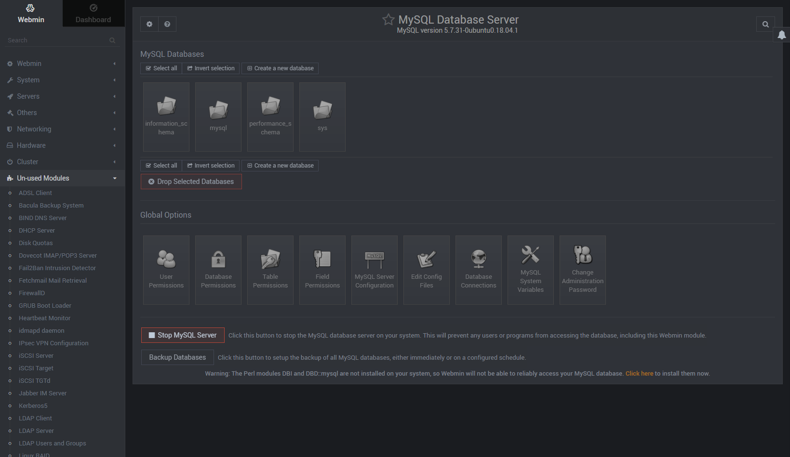

# Administração do Sistema Operacional

## Via web - Webmin

O Webmin é de longe a mais antiga e completa ferramenta livre, web-based, para gerenciamento de servidores Linux em atividade. Desenvolvido quase que integralmente em Perl, baseada no paradigma da programação em camadas, com suporte multi-idiomas e distribuído sob a licença BSD-like, atualmente (neste exato momento em que escrevo) o Webmin está na sua versão 1.479 e possui versões tanto para Linux, quanto Solaris, HP/UX, Apple MacOS X e alguns outros ports como para FreeBSD e até mesmo Windows. Todas as versões podem ser obtidas através da página oficial de downloads do projeto. Aproveitando-se do conceito de desenvolvimento em camadas (modular) e do fato de ser um software livre, é possível também se obter os módulos individualmente, bem como, desenvolver módulos adicionais sob demanda.

O Webmin roda sob o protocolo SSL (HTTPS) e portanto, caso você ainda não possua os pacotes mínimos necessários, vai precisar instalá-los:

### Instalando via repositório 

Instalando via repositório será garantido que o Webmin será atualizado juntamente com o Sistema Operacional.
~~~~shell
# sudo nano /etc/apt/sources.list
    deb https://download.webmin.com/download/repository sarge contrib

# wget https://download.webmin.com/jcameron-key.asc
# sudo apt-key add jcameron-key.asc
# sudo apt-get install apt-transport-https
# sudo apt-get update
# sudo apt-get install webmin
~~~~
No navegador acessar o gestor pelo endereço ``https://ip-do-server:10000``

Usuário e senha do próprio sistema.

## Instalando o MySQL

Tela Principal do MySQL no Wedmin

Tela de Usuário 

Tela de Criação de Usuário