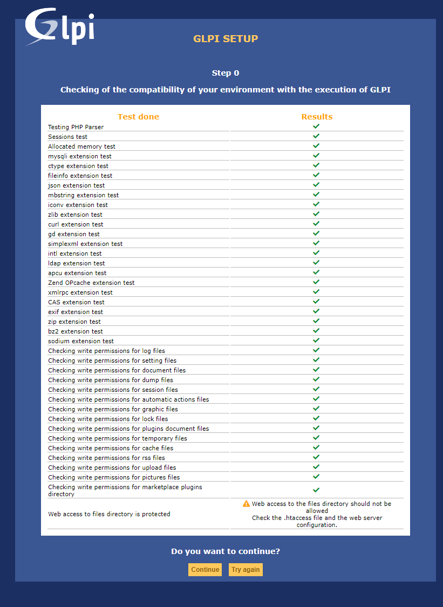
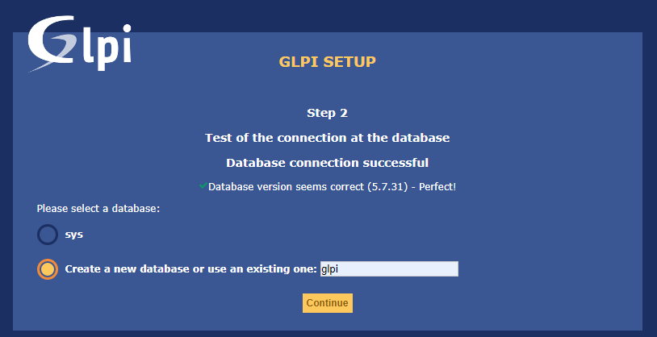
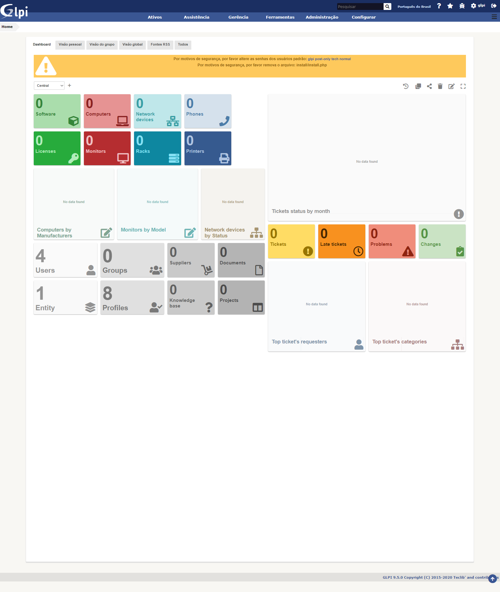

# GLPI (Inventario)

GLPi é um sistema de código aberto para Gerenciamento de Ativos de TI, rastreamento de problemas e central de serviços. Este software é escrito em PHP e distribuído sob a GNU General Public License. Como uma tecnologia de código aberto, qualquer pessoa pode executar, modificar ou desenvolver o código. Wikipédia

## Instalação dos pacotes

Como o GLPI estará no mesmo equipamento que o Zabbix grande parte dos pacotes já está instalado, esse seria a instalação.

### Pré-requisito
* Servidor Web - Apache2;
* SGBD - MySQL ou MariaDB **(O GLPI não da suporte ao PostgreSQL)**, instalado e administrado pelo Webmin;
* PHP 7.2
    * ctype;
    * curl;
    * gd (picture generation);
    * iconv;
    * intl;
    * json;
    * mbstring;
    * mysqli;
    * session;
    * simplexml;
    * zlib;
    * exif (security enhancement on images validation);
    * imap (mail collector and users authentication);
    * ldap (users authentication);
    * openssl (encrypted communication);
    * sodium (performances enhancement on sensitive data encryption/ decryption);
    * zip and bz2 (installation of zip and bz2 packages from  marketplace).

sudo apt-get -y install libapache2-mod-php php php-{curl,gd,imagick,intl,apcu,recode,memcache,imap,mysql,cas,ldap,tidy,pear,xmlrpc,pspell,gettext,mbstring,json,iconv,xml,gd,xsl} 

## Instalação do GLPI 

1. Acessar a pasta do servidor web;
1. Download do arquivo compactado do GLPI;
1. Descompactar o arquivo;
1. Ajustar as permissões.

~~~~shell
# cd /var/www/html/
# sudo wget https://github.com/glpi-project/glpi/releases/download/9.5.0/glpi-9.5.0.tgz
# sudo tar zxvf glpi-9.5.0.tgz
# sudo chown www-data:www-data -R glpi
~~~~

O restante da instalação é feita através da interface web.

Tela de login do GLPI

Tela Inicial do GLPI 9.5 recém instalado

## Ajustes pos instalação

1. Alterar a senhas dos usuários do sistema;
1. Remover a pasta de instalação do GLPI;
1. Adicionar o Timezone no banco de dados;

Está ação gera um erro de compatibilidade nas tabelas, para realizar a correação é necessário utilizar esse codigo 

# Plugins 

Para o melhor aproveitamento das capacidades e estende-las o GLPI tem acesso a vários plugins, a partir da versão 9.5.0 trazendo a marktplacem mas ainda tem a possibilidade da instalação manual. 

Para realizar a instalação de forma manual é necessário realizar do download do arquivos compactado e extrai-los na pasta de plugins do GLPI, em distribuições Linux com o web server **Apache** fica localizado em ``/var/www/html/glpi/plugins/`` e ajustar as permissões para usar o Servidor Web. Depois desse processo deve-se acessar o GLPI na aba **Configurações** escolher o item **Plugins**, então instalar ele, está operação cria as tabelas e prepara os arquivos do plugins (dependendo do plugin essa ação pode demorar um pouco) e ativa-lo para poder usar os novos recursos. 

Dentre os plugins posso citar estes
1. **FusionInventory - Inventario automático;**
2. DataInjection;
3. Fields (Campos Adicionais)
4. PrinterCounters (Contador das impressoras)

## FusionInventory - Inventario automático

 uma dos mais importantes se trata do FusionInventory. Este tem a função de realizar o inventario de forma automática da rede usando o protocolo **SNMP**.

## Download

sudo wget https://github.com/fusioninventory/fusioninventory-for-glpi/releases/download/glpi9.5.0%2B1.0/fusioninventory-9.5.0+1.0.tar.bz2

## Configurando o *cron*

/usr/bin/php7.2 /var/www/html/glpi/front/cron.php &>/dev/null

~~~~shell
# sudo crontab -e
~~~~

    * * * * * /usr/bin/php7.2 /var/www/html/glpi/front/cron.php &>/dev/null

fusioninventory-netinventory --host 172.15.0.10 \ --credentials version:2c,community:public