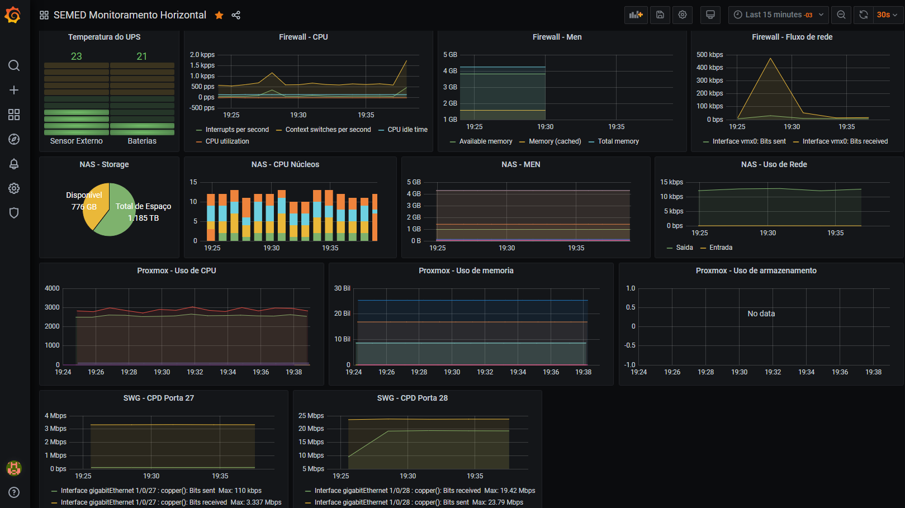

# O que é o Grafana?
O Grafana é uma plataforma para visualizar e analisar métricas por meio de gráficos. Ele tem suporte para diversos tipos de bancos de dados — tanto gratuitos quanto pagos —, e pode ser instalado em qualquer sistema operacional.

Para facilitar a visualização dos gráficos, é possível criar dashboards dinâmicos que podem ser compartilhados com toda a equipe. Além disso, a ferramenta permite configurar alertas com base nas métricas, que são analisadas de forma contínua para notificar o usuário sempre que preciso, de acordo com as regras definidas por ele. É bastante utilizado por sistemas de monitoramento para gerar gráficos real-time.

# Por que utilizar Grafana na sua empresa?
Com o Grafana, a empresa pode acompanhar todas as informações importantes vindas de diversas fontes — como bancos de dados e outras ferramentas — por meio de uma única interface intuitiva e completa. Isso facilita a gestão de indicadores e o monitoramento de dados em tempo real, o que torna a tomada de decisões na empresa mais rápida e eficiente.

Monitoramento dos sistemas da SEMED:

1. Temperatura do UPS;
2. Firewall (CPU, men e uso de rede);
3. NAS (Armazenamento, CPU, Men e uso de rede);
4. Proxmox (CPU, Men e uso de armazenamento);
5. Uso de rede no switch gerencial (portas para os andares).

Monitoramento das impressoras
* Imagem da impressoras;
* Contador;
* Lixeira e/ou cilindro;
* Níveis dos toners (sendo para todas as cores);
* Status do ping, para verificar se a impressoras está ligada.
# Referencias
[https://www.opservices.com.br/grafana/]