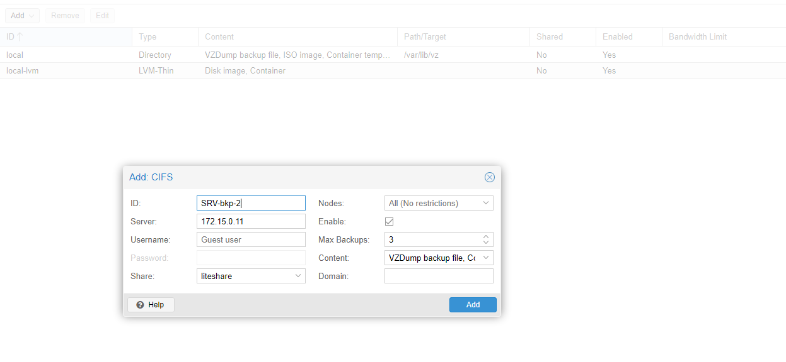
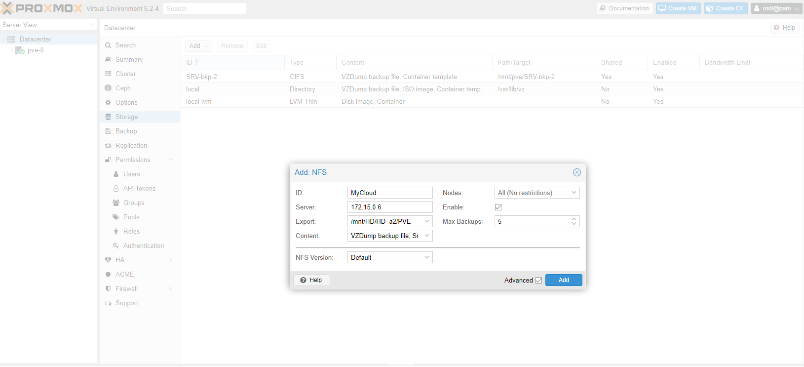

## Hardware dos Nodes

Item |  Node - 1 | node - 2
----|-------|----
placa-mãe | DL380 G7 |  DL380 G7
CPU | Intel(R) Xeon(R) CPU E5506 @ 2.13GHz |Intel(R) Xeon(R) CPU E5506 @ 2.13GHz 
Memorias  **ECC** | 32GB - 8 pentes -> 4GiB DIMM DDR3 Synchronous 1333 MHz | 32GB - 8 pentes -> 4GiB DIMM DDR3 Synchronous 1333 MHz
Placa de Rede  | 4 - NetXtreme II BCM5709 Gigabit Ethernet + 2 Offboard | 4 - NetXtreme II BCM5709 Gigabit Ethernet
Armazenamento  |LVM 278.86GiB |
HD's  | 4 SAS de 300GB | 

### Restart webinterface
~~~~shell
# service pveproxy status 
~~~~

# Atualização do PVE6-to-7

Os servidores Servidor HP Dl380 G7 apresentaram erro durante a instalação da versão 7 referente a resolução da tela, para contonar esse problema foi instalado a versão 6 e depois atualizar para a vesão corrente.

~~~~shell
# nano  /etc/apt/sources.list
    #deb http://ftp.br.debian.org/debian buster main contrib

    #deb http://ftp.br.debian.org/debian buster-updates main contrib

    # security updates
    # deb http://security.debian.org buster/updates main contrib
    #deb http://security.debian.org/debian-security bullseye-security main contrib

    deb http://ftp.us.debian.org/debian bullseye main contrib
    deb http://ftp.us.debian.org/debian bullseye-updates main contrib
    # security updates
    #deb http://security.debian.org bullseye-security main contrib
    deb http://security.debian.org/debian-security bullseye-security main contrib

    # PVE pve-no-subscription repository provided by proxmox.com,
    # NOT recommended for production use
    deb http://download.proxmox.com/debian/pve bullseye pve-no-subscription

# apt update

# reboot
~~~~
# Monitoramento

Os servidores PVE são monitorados via Zabbix (usando o agente) e via protocolo SNMP.

## Instalando o agente do Zabbix
~~~~shell
# apt update

# apt install zabbix-agent

# service zabbix-agent stop

# nano /etc/zabbix/zabbix_agentd.conf
    Server=172.15.0.102
    ServerActive=172.15.0.102
    Hostname=Nome_da_maquina_no_zabix

# service zabbix-agent start

# service zabbix-agent status
        ● zabbix-agent.service - Zabbix Agent
        Loaded: loaded (/lib/systemd/system/zabbix-agent.service; enabled; vendor preset: enabled)
        Active: active (running) since Mon 2023-01-02 11:03:41 -03; 4s ago
        Docs: man:zabbix_agentd
        Main PID: 3746 (zabbix_agentd)
        Tasks: 6 (limit: 4915)
        Memory: 3.0M
        CGroup: /system.slice/zabbix-agent.service
                ├─3746 /usr/sbin/zabbix_agentd --foreground
                ├─3752 /usr/sbin/zabbix_agentd: collector [idle 1 sec]
                ├─3753 /usr/sbin/zabbix_agentd: listener #1 [waiting for connection]
                ├─3754 /usr/sbin/zabbix_agentd: listener #2 [waiting for connection]
                ├─3755 /usr/sbin/zabbix_agentd: listener #3 [waiting for connection]
                └─3756 /usr/sbin/zabbix_agentd: active checks #1 [idle 1 sec]

        Jan 02 11:03:41 pve-2 systemd[1]: Started Zabbix Agent.
        Jan 02 11:03:41 pve-2 zabbix_agentd[3746]: Starting Zabbix Agent [pve-2]. Zabbix 4.0.4 (revision 89349).
        Jan 02 11:03:41 pve-2 zabbix_agentd[3746]: Press Ctrl+C to exit.
~~~~

## Ativando SMNP

O Proxmox por ser tratar de uma distribuição baseada no Debian tem sua ativação realizada através  da instalação dos pacotes “.deb” pelo comando, ``apt install snmpd lm-sensors snmptrapd`` tendo o pacote instalado e necessário a configuração o arquivo “smnpd.conf”:

1. Criar o backup do arquivo smnpd.conf, ``mv /etc/snmp/snmpd.conf /etc/snmp/snmpd.conf.ori``;

2. Criar um arquivo smnpd.conf, nano smnpd.conf;
~~~~shell
    # this create a  SNMPv1/SNMPv2c community named "my_servers"
    # and restricts access to LAN adresses 192.168.0.0/16 (last two 0's are ranges)
    rocommunity public 172.15.0.0/16

    # setup info
    syslocation  "CPD"
    syscontact  "semed.ni.ti@gmail.com"
    
    # open up
    agentAddress  udp:161
    
    # run as
    agentuser  root
    
    # dont log connection from UDP:
    dontLogTCPWrappersConnects yes
    
    # fix for disks larger then 2TB
    realStorageUnits 0
~~~~
       
3. ~~Ativar exceção no firewall, ``iptables -A INPUT -s 172.15.0.0/16 -p udp --dport 161 -j ACCEPT``~~;
4. Reiniciar o  daemon do SMNP, ``service snmpd restart``;
5. Tornar o protocolo ativo por padrão, ``update-rc.d snmpd enable``.

~~~~shell
# nano /etc/apt/sources.list
    deb http://deb.debian.org/debian stretch main contrib non-free
    deb-src http://deb.debian.org/debian stretch main contrib non-free

    deb http://security.debian.org/debian-security/ stretch/updates main contrib non-free
    deb-src http://security.debian.org/debian-security/ stretch/updates main contrib non-free

    deb http://deb.debian.org/debian stretch-updates main contrib non-free
    deb-src http://deb.debian.org/debian stretch-updates main contrib non-free

# apt update

# apt-get install snmp-mibs-downloader
~~~~

# Alterando IP do ProxMox
para alterar os IP foi preceso reconfigurar dois arquivos, interfaces e hosts

~~~~shell
# nano /etc/network/interfaces
    auto lo
    iface lo inet loopback

    iface enp1s0 inet manual

    auto vmbr0
    iface vmbr0 inet static
        address 172.15.XX.XX/16
        gateway 172.15.0.33
        bridge-ports enp1s0
        bridge-stp off
        bridge-fd 0

# nano /etc/hosts
    127.0.0.1 localhost.localdomain localhost
    172.15.XX.XX pve.semed.pcni pve

    # The following lines are desirable for IPv6 capable hosts

    ::1     ip6-localhost ip6-loopback
    fe00::0 ip6-localnet
    ff00::0 ip6-mcastprefix
    ff02::1 ip6-allnodes
    ff02::2 ip6-allrouters
    ff02::3 ip6-allhosts

# reboot
~~~~

## Local das ISO's
No proprio ProxMox

~~~~shell
# /var/lib/vz/template/iso/
~~~~

No compartilhamento usando Windows

``D:\PVE\template\iso``

## Storage Externo

Para adicionar armazenamento externo é preciso acessar no *Datacenter -> Storage -> Add* e escolher o tipo de armazenamento.

### CIFS
Nesse exemplo vou utilizar outra maquina, usando o LinuxLite com o Samba, para hospedar os backups.

+ ID -> Nome do instância do compartilhamento, pode ser qualquer um;

+ Server -> Endereço do servidor, usei o IP, com o DNS configurado no servidor poderia ser usado o nome;

+ Username e Password -> caso o compartilhamento sejá por autenticação;

+ Share -> pasta compartilhada;

+ Nodes-> Para criação de restrição de uso no storage por determinado *node*;

+ Enable -> habilitado;

+ Max Backups -> quantidade de Backups que serão armazenados no servidor;

+ Content -> são os itens que serão armazenados nos servidor, nesse caso *VZDump backup file* e *Container template*;

+ Domain -> ???????

### NFS

## Instalação do Certificado

Para aparecer mais a tela de erro de certificado no navegador é preciso instalar o certificado ssl do servidor PVE

Com o FileZilla copiei o arquivo /etc/pve/pve-root-ca.pem

---
## removendo CT com replicação travada

pvesr list -> Lista as tarefas de replicação

pvesr delete 116-0 --force -> remove o job da replicação

pct destroy 116 -> destroi o CT

##  storage 'ad2server' does not exists

rm /etc/pve/lxc/109.conf

## Adicionado novo HD
https://www.hostfav.com/blog/index.php/2017/02/01/add-a-new-physical-hard-drive-to-proxmox-ve-4x-5x/

## Alterando ip do storage
https://forum.proxmox.com/threads/nfs-shared-storage-ip-changed-what-configs-to-change-to-access-vms.9829/

# processo de recuperação de queima de HD 25/10/2020
https://lucatnt.com/2019/11/moving-proxmox-zfs-boot-drive-to-a-new-disk/

para tentar recuperar a plataforma 
https://forum.proxmox.com/threads/how-to-restore-a-container-when-the-container-conf-is-lost.66002/

https://forum.proxmox.com/threads/how-to-migrate-a-virtual-machine-image-into-local-lvm.28751/

https://pve.proxmox.com/wiki/Root_Password_Reset#Resetting_the_root_account_password_in_a_Container