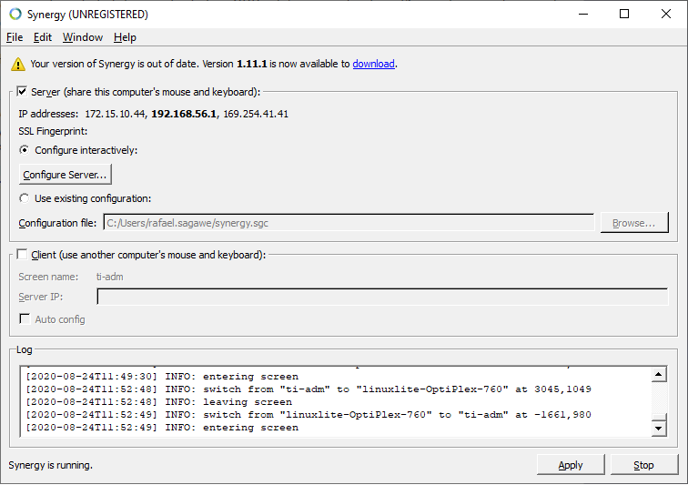
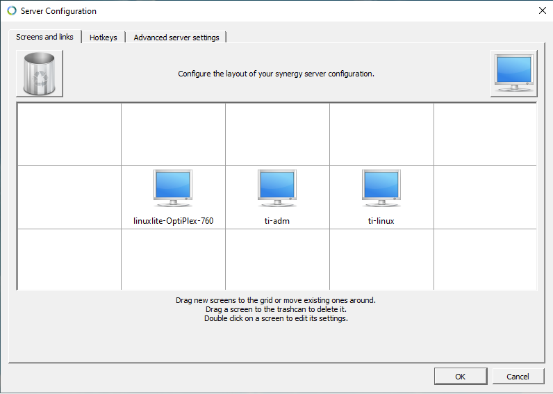

# Erros do Windows

    sfc /scannow

    chkdsk

# Recuperar ícones não identificados

Devido a um erro na geração dos **caches** de ícones, a area de trabalho e a barra de tarefas ficam com ícones não identificados, para recupera-los foi necessário seguir alguns passos:

1. Acessar a pasta dos arquivos de **cache**, no windowns 10 fica em ``C:\Users\Nome_do_Usuário\AppData\Local\Microsoft\Windows\Explorer``;

2. No gerenciador de tarefas é necessário para o ``Explorer``;

3. Usando o ``CMD`` em modo *Administrador* na pasta do **cache**;

4. Remova os arquivos de **cache** usando o comando ``del iconcache*``;

5. No gerenciador de tarefas inicie novamente o Explorer é os ícones devem está normais.

# Controlar varios PCs com um mouse e teclado

E possível controlar varios computadores com o mesmo kit de mouse e teclado. Para realizar está tarefa e usado o synergy (Windowns) e o quicksynergy (Linux), o equipamento com o kit será o servidor enquanto os outros são os clientes.

## configuração no Windowns

Instalação no LinuxLite e outros base DEB

~~~~shell
$ sudo apt install quicksynergy
~~~~
Para iniciar o synergy no inicio da sessão, sem a necessidade de intervenção

~~~~shell
 /usr/bin/synergyc 172.15.10.44
 ~~~~

## libera espaço e desativa a hibernação
 ~~~~shell
 > powercfg.exe /hibernate off
 ~~~~

# winget 
Recurso similar ao apt install das distros like-Debian.

## Instalando 

## Usando o recurso

### Atuluzando individualmente
~~~~shell
> winget upgrade nome_da_aplicação
~~~~

### Atulizando todos os pendentes
~~~~shell
> winget upgrade --all
~~~~

### Busca
 ~~~~shell
 > winget search firefox
 ~~~~