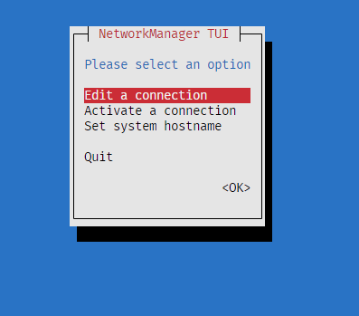

# Instalação
 Instalação minima do Sistema Operacional

O Rocky Linux é um sistema operacional empresarial de código aberto projetado para ser 100% bug-a-bug compatível com o Red Hat Enterprise Linux®. Está em intenso desenvolvimento pela comunidade. 

## Criação de usuário
~~~~shell
# sudo adduser rafael
# sudo passwd rafael
~~~~

## Obtendo o IP
~~~~shell
# ip -c route
~~~~

## Pacotes basicos

~~~~shell
# sudo dnf -y install epel-release
# sudo dnf install nano htop
~~~~

### Erro de pacote

Problem: cannot install the best update candidate for package python-unversioned-command-3.9.16-1.el9.noarch
  - nothing provides python3 = 3.9.16-1.el9_2.1 needed by python-unversioned-command-3.9.16-1.el9_2.1.noarch
(try to add '--skip-broken' to skip uninstallable packages or '--nobest' to use not only best candidate packages)

~~~~shell
# dnf clean all
# yum install python-unversioned-command
# yum update
~~~~

## Ajustando o IP

~~~~shell
# nmtui
~~~~

# Instalação do Podman e cockpit

Podman é uma ferramenta multiplataforma de linha de comando, Open-Source, que permite criar e gerenciar imagens de contêiner diretamente, sob licença Apache-2.0. Desenvolvido inicialmente no projeto Atomic, do Fedora Atomic Host (Red Hat), o Podman agora é mantido pela containers organization. Disponibilizado também nos repositórios do Red Hat Enterprise Linux, Fedora e CentOS.

~~~~shell
# sudo dnf update
# sudo dnf -y install podman buildah 

# podman -v
    podman version 4.4.1

# podman info
    host:
    arch: amd64
    buildahVersion: 1.29.0
    cgroupControllers:
    - memory
    - pids
    cgroupManager: systemd
    cgroupVersion: v2
    conmon:
        package: conmon-2.1.7-1.el9_2.x86_64
        path: /usr/bin/conmon
        version: 'conmon version 2.1.7, commit: e6cdc9a4d6319e039efa13e532c1e58b713c904d'
    cpuUtilization:
        idlePercent: 97.21
        systemPercent: 0.72
        userPercent: 2.07
    cpus: 4
    distribution:
        distribution: '"rocky"'
        version: "9.2"
    eventLogger: journald
    hostname: localhost.localdomain
    idMappings:
        gidmap:
        - container_id: 0
        host_id: 1000
        size: 1
        - container_id: 1
        host_id: 100000
        size: 65536
        uidmap:
        - container_id: 0
        host_id: 1000
        size: 1
        - container_id: 1
        host_id: 100000
        size: 65536
    kernel: 5.14.0-284.11.1.el9_2.x86_64
    linkmode: dynamic
    logDriver: journald
    memFree: 817102848
    memTotal: 1673273344
    networkBackend: netavark
    ociRuntime:
        name: crun
        package: crun-1.8.4-1.el9_2.x86_64
        path: /usr/bin/crun
        version: |-
        crun version 1.8.4
        commit: 5a8fa99a5e41facba2eda4af12fa26313918805b
        rundir: /run/user/1000/crun
        spec: 1.0.0
        +SYSTEMD +SELINUX +APPARMOR +CAP +SECCOMP +EBPF +CRIU +YAJL
    os: linux
    remoteSocket:
        path: /run/user/1000/podman/podman.sock
    security:
        apparmorEnabled: false
        capabilities: CAP_CHOWN,CAP_DAC_OVERRIDE,CAP_FOWNER,CAP_FSETID,CAP_KILL,CAP_NET_BIND_SERVICE,CAP_SETFCAP,CAP_SETGID,CAP_SETPCAP,CAP_SETUID,CAP_SYS_CHROOT
        rootless: true
        seccompEnabled: true
        seccompProfilePath: /usr/share/containers/seccomp.json
        selinuxEnabled: true
    serviceIsRemote: false
    slirp4netns:
        executable: /usr/bin/slirp4netns
        package: slirp4netns-1.2.0-3.el9.x86_64
        version: |-
        slirp4netns version 1.2.0
        commit: 656041d45cfca7a4176f6b7eed9e4fe6c11e8383
        libslirp: 4.4.0
        SLIRP_CONFIG_VERSION_MAX: 3
        libseccomp: 2.5.2
    swapFree: 4013944832
    swapTotal: 4013944832
    uptime: 0h 11m 38.00s
    plugins:
    authorization: null
    log:
    - k8s-file
    - none
    - passthrough
    - journald
    network:
    - bridge
    - macvlan
    volume:
    - local
    registries:
    search:
    - registry.access.redhat.com
    - registry.redhat.io
    - docker.io
    store:
    configFile: /home/administrador/.config/containers/storage.conf
    containerStore:
        number: 0
        paused: 0
        running: 0
        stopped: 0
    graphDriverName: overlay
    graphOptions: {}
    graphRoot: /home/administrador/.local/share/containers/storage
    graphRootAllocated: 239700623360
    graphRootUsed: 1705213952
    graphStatus:
        Backing Filesystem: xfs
        Native Overlay Diff: "true"
        Supports d_type: "true"
        Using metacopy: "false"
    imageCopyTmpDir: /var/tmp
    imageStore:
        number: 0
    runRoot: /run/user/1000/containers
    transientStore: false
    volumePath: /home/administrador/.local/share/containers/storage/volumes
    version:
    APIVersion: 4.4.1
    Built: 1683632637
    BuiltTime: Tue May  9 08:43:57 2023
    GitCommit: ""
    GoVersion: go1.19.6
    Os: linux
    OsArch: linux/amd64
    Version: 4.4.1
~~~~

# Instalando o cockpit

Cockpit um Dashboard web para gerenciar seu Servidores.

~~~~shell
# sudo dnf install -y cockpit cockpit-machines cockpit-podman 
~~~~

## Ativando a inicialização

~~~~shell
# sudo systemctl start cockpit.socket
    
# sudo systemctl enable cockpit.socket
    Created symlink /etc/systemd/system/sockets.target.wants/cockpit.socket → /usr/lib/systemd/system/cockpit.socket.

# sudo systemctl status cockpit.socket
    cockpit.socket - Cockpit Web Service Socket
        Loaded: loaded (/usr/lib/systemd/system/cockpit.socket; enabled; preset: disabled)
        Active: active (listening) since Fri 2023-06-23 11:47:20 -03; 12s ago
        Until: Fri 2023-06-23 11:47:20 -03; 12s ago
    Triggers: ● cockpit.service
        Docs: man:cockpit-ws(8)
        Listen: [::]:9090 (Stream)
        Tasks: 0 (limit: 9947)
        Memory: 8.0K
            CPU: 16ms
        CGroup: /system.slice/cockpit.socket

    Jun 23 11:47:20 localhost.localdomain systemd[1]: Starting Cockpit Web Service Socket...
    Jun 23 11:47:20 localhost.localdomain systemd[1]: Listening on Cockpit Web Service Socket.
~~~~

## Liberando no firewall

~~~~shell
# sudo firewall-cmd --add-service cockpit --permanent
    Warning: ALREADY_ENABLED: cockpit
    success

# sudo firewall-cmd --reload
    success
~~~~

