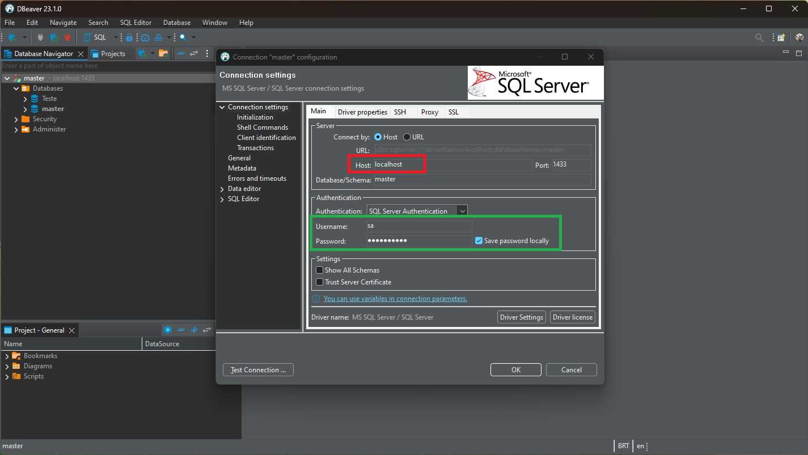

Melhor funcionamento no Ubuntu 20.04

# Instalação 

Importe as chaves GPG do repositório público:
~~~~shell
# wget -qO- https://packages.microsoft.com/keys/microsoft.asc | sudo tee /etc/apt/trusted.gpg.d/microsoft.asc
~~~~

Registre o repositório do Ubuntu do SQL Server, atualizar os sistema e instalação do SGBD no sistema:

~~~~shell
# sudo add-apt-repository "$(wget -qO- https://packages.microsoft.com/config/ubuntu/20.04/mssql-server-2022.list)"

# sudo apt-get update
# sudo apt-get install -y mssql-server
~~~~
Após a conclusão da instalação do pacote, execute a mssql-conf setup e siga os prompts para definir a senha SA e escolher sua edição. Como lembrete, as seguintes edições do SQL Server são licenciadas gratuitamente: Evaluation, Developer e Express.

~~~~shell
# sudo /opt/mssql/bin/mssql-conf setup

3 - Express
~~~~
Após concluir a configuração, verifique se o serviço está em execução

~~~~shell
# systemctl status mssql-server --no-pager
~~~~

Execute o sqlcmd com parâmetros para o nome do SQL Server (-S), o nome de usuário (-U) e a senha (-P).

## Instalando as ferramentas 

Registre o repositório do Microsoft Ubuntu.

~~~~shell
# curl https://packages.microsoft.com/config/ubuntu/20.04/prod.list | sudo tee /etc/apt/sources.list.d/msprod.list
~~~~
Atualize a lista de fontes e execute o comando de instalação com o pacote do desenvolvedor do unixODBC.

~~~~Bash
# sudo apt-get update
# sudo apt-get install mssql-tools unixodbc-dev
~~~~

Observação Para atualizar para a versão mais recente do mssql-tools, execute os seguintes comandos:

Para tornar o sqlcmd/bcp acessível do shell de Bash para sessões de logon, modifique o PATH no arquivo ~/.bash_profile com o seguinte comando:

~~~~Bash
# echo 'export PATH="$PATH:/opt/mssql-tools/bin"' >> ~/.bash_profile
~~~~

## Conectar-se localmente

Execute o sqlcmd com parâmetros para o nome do SQL Server (-S), o nome de usuário (-U) e a senha (-P). Neste tutorial, você está se conectando localmente, portanto, o nome do servidor é localhost. O nome de usuário é sa e a senha é a mesma fornecida para a conta SA durante a instalação.

~~~~shell
# sqlcmd -S localhost -U SA -P '@Senha123'
~~~~

### Criando um bando de teste

~~~~sql
1> create database Teste;
2> SELECT Name from sys.databases;
3> GO
~~~~

## Usando o DBeaver

1. O local do servidor, nome ou IP, neste caso o localhost
2. As credenciais de acesso:

Usuário | sa
---|---
Senha | @Senha123

[Fonte da pesquisa](https://learn.microsoft.com/pt-br/sql/linux/quickstart-install-connect-ubuntu?view=sql-server-ver16)
