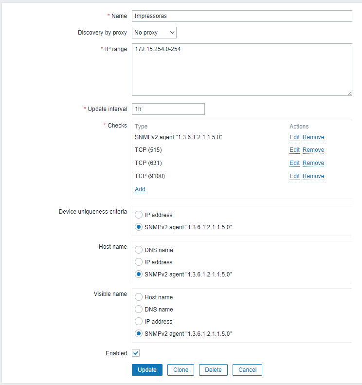

.|Cadastrar todos os equipamentos de uma rede pode ser uma tarefa grande e demorada, para isso o Zabbix tem a possibilidade de realizar um auto-registro dos hosts

## Discovery
Em Configuration ->  Discovery rules -> Create Discovery rule

IP range | 172.15.254.0-254
--|--
Update interval | 1h Uma hora entra cada intervalo.
Checks| Type
   . |SNMPv2 agent "1.3.6.1.2.1.1.5.0"
   . |TCP (515)
   . |TCP (631)
.|TCP (9100)
Device uniqueness criteria| IP address
.|SNMPv2 agent "1.3.6.1.2.1.1.5.0"
Host name | DNS name
.|IP address
.|SNMPv2 agent "1.3.6.1.2.1.1.5.0"
Visible name |Host name
.|DNS name
.|IP address
.|SNMPv2 agent "1.3.6.1.2.1.1.5.0"

## Discovery actions

Em Configuration -> Discovery actions -> Create Action

 

