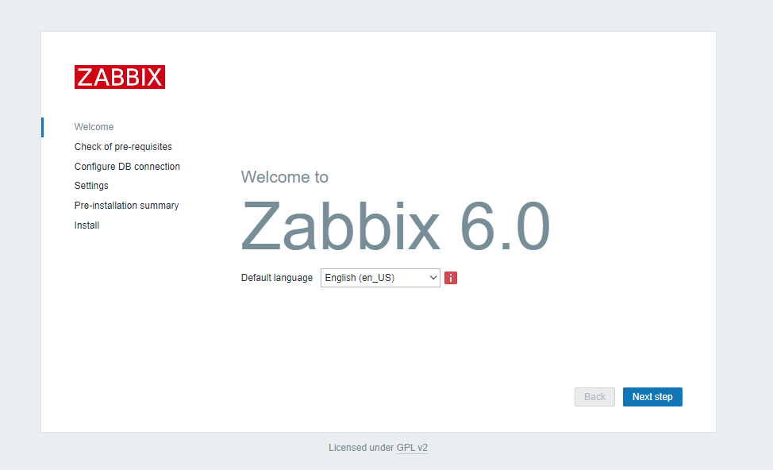
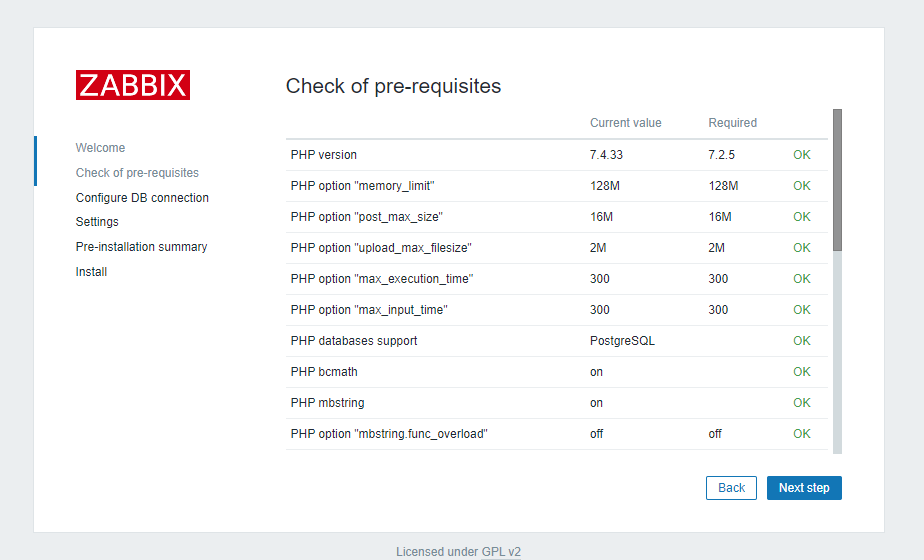
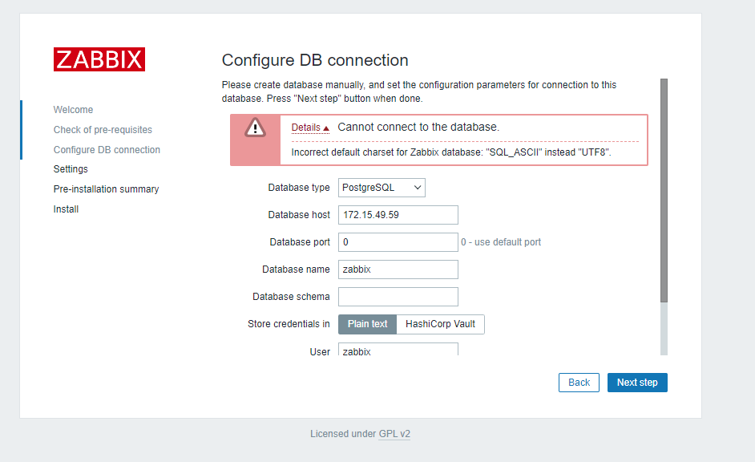
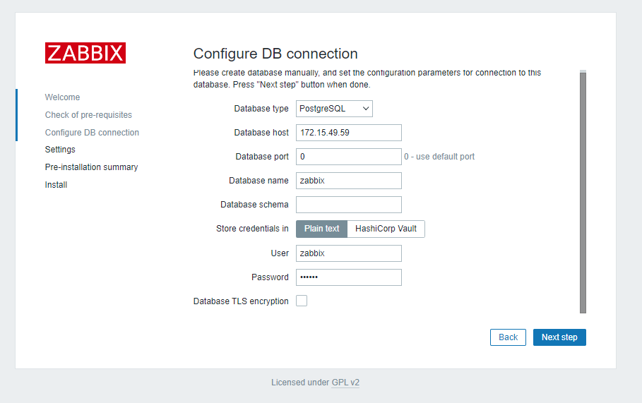
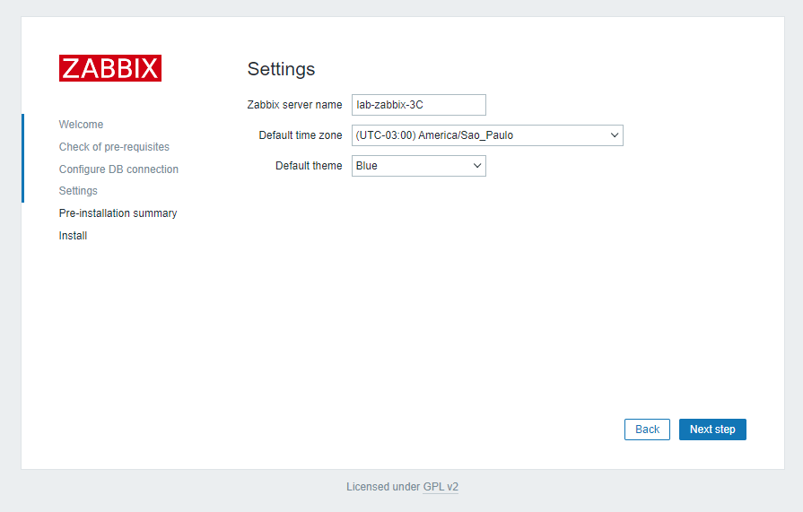
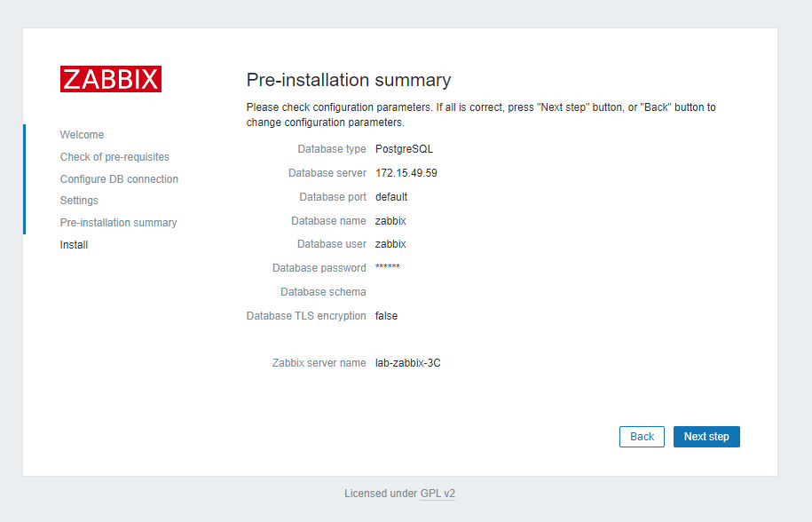
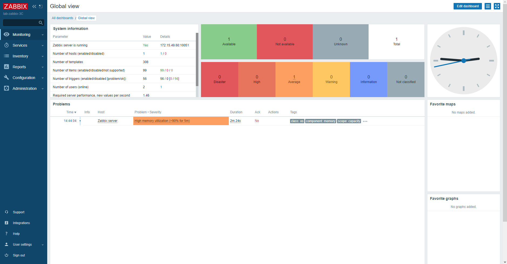
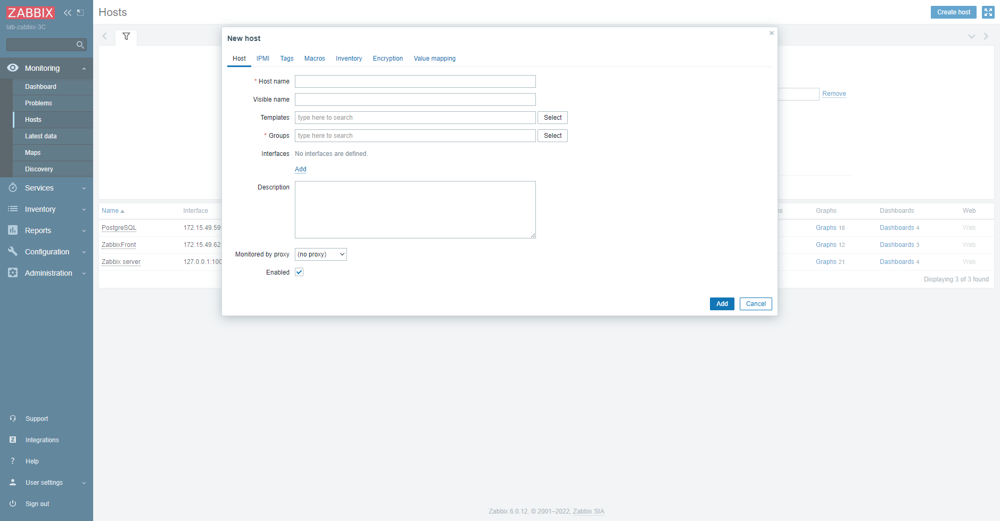

# Instalação do ambiente Zabbix em 3 Camadas

No laboratorio foi utilizado o template ``debian-11-turnkey-core_17.1-1_amd64.tar.gz`` para geração dos container.

Hardware

Item | Valores
--|--
Core | 2
Mem |1.00 GB
Swap | 512mb
HD |10 GB

### Materiais usados como base 

https://github.com/raphaelrrl/scritps

https://www.youtube.com/watch?v=Cb4D4WxeYN8

## 1. Banco de dados (PostgreSQL)

~~~~shell
# cd /tmp/

# wget https://repo.zabbix.com/zabbix/6.0/debian/pool/main/z/zabbix-release/zabbix-release_6.0-4%2Bdebian11_all.deb

# dpkg -i zabbix-release_6.0-4+debian11_all.deb

# apt update

# apt install -y zabbix-sql-scripts zabbix-agent postgresql-13 sudo

~~~~

### Liberar conexão no bando de dados

``Por se tratar de um laboratorio o postgres estará aberto para todos os acessos, não sendo recomendado para produção pois torna o sistema vulneravel a ataques.``

~~~~shell
# cd /etc/postgresql/13/main/

nano postgresql.conf
    listen_addresses = '*' 

nano pg_hba.conf
    # IPv4 local connections:
    #host    all             all             127.0.0.1/32            md5
    host    all             all             0.0.0.0/0               trust

# service postgresql restart

# service postgresql status 
    * postgresql.service - PostgreSQL RDBMS
        Loaded: loaded (/lib/systemd/system/postgresql.service; enabled; vendor preset: enabled)
        Active: active (exited) since Fri 2023-01-20 10:52:03 -03; 50s ago
        Process: 8049 ExecStart=/bin/true (code=exited, status=0/SUCCESS)
    Main PID: 8049 (code=exited, status=0/SUCCESS)
            CPU: 1ms

    Jan 20 10:52:03 PostgreSQL systemd[1]: Starting PostgreSQL RDBMS...
    Jan 20 10:52:03 PostgreSQL systemd[1]: Finished PostgreSQL RDBMS.
~~~~
### Iniciando o banco de dados

~~~~shell
# sudo -u postgres createuser --pwprompt zabbix
        zabbix

# sudo -u postgres createdb --template=template0  --encoding=UTF8 -O zabbix zabbix
~~~~

Os parametros ``--template=template0`` e ``--encoding=UTF8`` foram adicionados devido a um erro que surgiu durante a instalação web.

Verificando se tudo ocorreu como o esperado.

``Ate esse momento o usuário postgres não possui senha``

~~~~shell
# su postgres

$ psql
    postgres=# \du
                                   List of roles
 Role name |                         Attributes                         | Member of
-----------+------------------------------------------------------------+-----------
 postgres  | Superuser, Create role, Create DB, Replication, Bypass RLS | {}
 zabbix    |                                                            | {}
    
    postgres=# \l
                                List of databases
    Name    |  Owner   | Encoding  | Collate | Ctype |   Access privileges
    -----------+----------+-----------+---------+-------+-----------------------
    postgres  | postgres | SQL_ASCII | C       | C     |
    template0 | postgres | SQL_ASCII | C       | C     | =c/postgres          +
              |          |           |         |       | postgres=CTc/postgres
    template1 | postgres | SQL_ASCII | C       | C     | =c/postgres          +
              |          |           |         |       | postgres=CTc/postgres
    zabbix    | zabbix   | SQL_ASCII | C       | C     |
    (4 rows)
~~~~

### Importando base de dados do zabbix

~~~~shell
# zcat /usr/share/zabbix-sql-scripts/postgresql/server.sql.gz | sudo -u zabbix psql zabbix
~~~~

## 2. Aplicação (Zabbix Server)

Instalando a 

~~~~shell
# cd /tmp/

# wget https://repo.zabbix.com/zabbix/6.0/debian/pool/main/z/zabbix-release/zabbix-release_6.0-4%2Bdebian11_all.deb

# dpkg -i zabbix-release_6.0-4+debian11_all.deb

# apt update

# apt install -y zabbix-server-pgsql zabbix-agent
~~~~

Fazando ajustes no Zabbix Server, conforme as configurações do banco de dados.

~~~~shell
# nano /etc/zabbix/zabbix_server.conf
    DBHost=172.15.49.59
    DBName=zabbix
    DBUser=zabbix
    DBPassword=zabbix
~~~~

Item | comentário
--|--
DBHost | Enredeço do BD (no laboratorio foi usado o IP via DHCP)
DBName | Nome do BD padrão do zabbix
DBUser | Usuário do banco (padrão para facilitar)
DBPassword | Senha do banco (mesmo que o nome do usuário, para simplificar)

Restartar a aplicação para verificar se está funcionando

~~~~shell
# service zabbix-server restart 
# service zabbix-server status  
    * zabbix-server.service - Zabbix Server
        Loaded: loaded (/lib/systemd/system/zabbix-server.service; disabled; vendor preset: enabled)
        Active: active (running) since Fri 2023-01-20 12:06:34 -03; 5s ago
        Process: 5469 ExecStart=/usr/sbin/zabbix_server -c $CONFFILE (code=exited, status=0/SUCCESS)
    Main PID: 5471 (zabbix_server)
        Tasks: 1 (limit: 38425)
        Memory: 2.6M
            CPU: 25ms
        CGroup: /system.slice/zabbix-server.service
                `-5471 /usr/sbin/zabbix_server -c /etc/zabbix/zabbix_server.conf

    Jan 20 12:06:34 ZabbixServer systemd[1]: Starting Zabbix Server...
    Jan 20 12:06:34 ZabbixServer systemd[1]: Started Zabbix Server.
~~~~

### Iniciando o Zabbix com o sistema

~~~~shell
# systemctl enable zabbix-server
~~~~

### Arquivo de log
~~~~shell
# tail -f /var/log/zabbix/zabbix_server.log
~~~~
## 3. Front (Nginx)

~~~~shell
# cd /tmp/

# wget https://repo.zabbix.com/zabbix/6.0/debian/pool/main/z/zabbix-release/zabbix-release_6.0-4%2Bdebian11_all.deb

# dpkg -i zabbix-release_6.0-4+debian11_all.deb

# apt update

# apt install -y zabbix-frontend-php php7.4-pgsql zabbix-nginx-conf zabbix-agent

~~~~

Descomentar os parametros 'listen' e 'server_name'

~~~~shell
# nano /etc/zabbix/nginx.conf
# service nginx restart 
# service nginx status  
    * nginx.service - A high performance web server and a reverse proxy server
        Loaded: loaded (/lib/systemd/system/nginx.service; enabled; vendor preset: enabled)
        Active: active (running) since Fri 2023-01-20 12:35:19 -03; 6s ago
        Docs: man:nginx(8)
        Process: 19166 ExecStartPre=/usr/sbin/nginx -t -q -g daemon on; master_process on; (code=exited, status=0/SUCCESS)
        Process: 19167 ExecStart=/usr/sbin/nginx -g daemon on; master_process on; (code=exited, status=0/SUCCESS)
    Main PID: 19168 (nginx)
        Tasks: 3 (limit: 38425)
        Memory: 3.4M
            CPU: 44ms
        CGroup: /system.slice/nginx.service
                |-19168 nginx: master process /usr/sbin/nginx -g daemon on; master_process on;
                |-19169 nginx: worker process
                `-19170 nginx: worker process

    Jan 20 12:35:19 ZabbixFont systemd[1]: Starting A high performance web server and a reverse proxy server...
    Jan 20 12:35:19 ZabbixFont systemd[1]: Started A high performance web server and a reverse proxy server.
~~~~

Iniciar o front junto com o sistema

~~~~shell
# systemctl enable zabbix-agent nginx php7.4-fpm
~~~~

Acessando o Zabbix, 

Para contornar esse erro recriei o banco de dados, por isso esta diferente da documentação oficial.

## 4. Agent e criação dos hosts
Um dos itens instalado era o agent do zabbix, agora será configurado.

Para o zabbix começar a monitorar só é preciso configurar:
* ``Server`` -> Usando o endereço do Servidor Zabbix, nesse laboratorio ``172.15.49.60``
* ``Hostname`` -> já o hostname é o nome do equipamento que será manitorado, tendo que ser o mesmo na configuração na interface web.

~~~~shell
# nano /etc/zabbix/zabbix_agentd.conf
    Server=172.15.49.60
~~~~

Hostname | PostgreSQL | ZabbixFront 

~~~~shell
service zabbix-agent restart
~~~~

Item | Valor
--|--
Host name | Mesmo usado na configuração do agente
Templates | Tipo de monitaramento da maquina (Linux, Windowns, Web, Ping)
Groups | A qual grupo de equipamentos ele pertence
Interfaces | Agent (nesse exemplo), SNMP ...
IP address | IP do host onde o agente se encontra

## 4.1. Monitorando nginx

Para melhor monitorar o Servidor Web do zabbix, nesse caso o nginx, torna-se necessario a adição de seguintes parametros nas configurações do serviço.

~~~~shell
 # nano /etc/nginx/sites-enabled/default

 location = /basic_status {
    stub_status;
    allow 127.0.0.1;
    allow ::1;
    deny all;
}

# nginx -t

# curl localhost/basic_status
    Active connections: 2
    server accepts handled requests
    4 4 5

# service nginx restart
~~~~

Como template é utilizado o ``Nginx by Zabbix agent``.

## 4.1. Monitorando nginx

## 5 Consertando erros iniciais

### 5.1 Zabbix server: Utilization of discoverer processes over 75%

Descomentar a linha StartDiscoverers=1 e alterar para 5 o valor.
~~~~shell 
# nano /etc/zabbix/zabbix_server.conf
    StartDiscoverers=5
~~~~

